# PREFACE

This document is the product of a multi-year effort that started with a two-and-a-half-day workshop organized by the NASA Ocean Ecology Lab Field Support Group and hosted at NASA Goddard Space Flight Center from November 30–December 2, 2016. 
The original objective was to produce community consensus protocols for sample collection, filtration, storage, analysis, and quality assurance for particulate organic carbon in all natural waters, emphasizing marine ecosystems, appropriate for satellite algorithm development and validation. 
Given the close link between global cycles of carbon and nitrogen and that current analytical protocols usually are geared towards their simultaneous measurement, recommendations for analysis of nitrogen in particles are also included. 
The hope is that the protocols presented here can be widely adopted by the academic scientific community engaged in aquatic C and N cycle research, particularly in activities that support ocean color validation. 
The resulting protocol review document: Particulate Organic Matter Sampling and Measurement Protocols: Consensus Towards Future Ocean Color Missions, and the associated workshop activity were sponsored by the National Aeronautics and Space Administration (NASA), including funding for the Field Support Group (NASA Ocean Biology and Biogeochemistry Program) and a ROSES NNH15ZDA001N-TWSC award to Antonio Mannino, Ivona Cetinić, Joaquín Chaves, Michael Novak, and Jeremy Werdell under the NASA Program Topical Workshops, Symposia, and Conferences Program with additional support for contributing authors and workshop participants by their respective institutions. 
This document provides a detailed discussion of state-of-the-art technologies and protocols for sampling and measuring aquatic particulate organic carbon and particulate nitrogen. 
Appendix A provides a summary of best practices and recommendations for those developing a research program that includes measurements of POM. 
Significant contributions by all authors and reviewers made the completion of this document possible. Reference herein to any specific commercial products, processes, or services by trade name, trademark, manufacturer, or otherwise does not constitute or imply its endorsement or recommendation by the authors or their employers.

# Table of Contents

1. Introduction and Background	7
2. Sample Collection	9
	- 2.1 In situ Pumps	9
	- 2.2 Shipboard Underway Systems	10
	- 2.3 Niskin Bottles	11
3. Sample Processing	15
	- 3.1 Bench-Top Filtration	15
	- 3.2 Filter Type	15
	- 3.3 Filter Combustion	19
	- 3.4 Filtration Pressure	19
	- 3.5 Replication	20
	- 3.6 Sample Storage and Shipment	20
4. Filtrate Blank	21
	- 4.1 Regression-Based Corrections	22
	- 4.2 Filtrate Blank Filters	24
	- 4.3 Dipped Blanks from in situ Filtration	25
	- 4.4 Measurement Precision: Filtrate Blank Filters vs. Regression Correction	26
5. Sample Processing for Elemental Analysis	26
	- 5.1 Filter Sub-Sampling	26
	- 5.2 Drying		26
	- 5.3 Removal of Inorganic Carbon	27
	- 5.4 Sample Encapsulation	28
6. Elemental Analysis	29
	- 6.1 Instrumentation	29
	- 6.2 Calibration and Performance	31
	- 6.3 Calculations and Data Analysis	33
	- 6.4 Uncertainty and Performance Metrics	35
	- 6.5 Balance Precision and Weighing Protocol	40
	- 6.6 Reporting	40
	- 6.7 Consensus Reference Material	42
7.	References	43
- A. Summary Appendices	50
	- A.1.1	Consensus Summary of Best Practices	50
	- A.1.2	General Guidelines	50
	- A.1.3	Niskin Bottle Sampling	50
	- A.1.4	Sample Processing	51
	- A.1.5	Filtrate Blank	51
	- A.1.6	Analytical Filter Blank	52
	- A.1.7	Sample Processing for Analysis	52
	- A.1.8	Sample Encapsulation	53
	- A.1.9	Weighing	53
	- A.1.10	Elemental Analysis	53
	- A.1.11	Median Absolute Deviation in Outlier Detection	54

# 1. Introduction and Background

Particulate organic carbon (POC) in the surface ocean is a highly dynamic carbon (C) reservoir that comprises a relatively small fraction (~3%) of the total organic carbon in the upper ocean (Gardner et al., 2006; Hansell et al., 2009). POC provides one of the primary paths for C sequestration through the biological pump into the deep ocean and seafloor (Longhurst and Glen Harrison, 1989; Volk and Hoffert, 1985). POC includes both the living biomass (e.g., phytoplankton, zooplankton, bacteria) and the non-living particulate organic matter (e.g., particulate organic matter (POM), the detritus and organic matter associated with sediments) that support food webs throughout the global ocean as well as coastal and inland waters. The global biogeochemical cycles of C and nitrogen (N) are tightly coupled as two of the main components in biomass. Quantifying their elemental ratios in aquatic particulate matter is important for understanding key ecosystem processes (Martiny et al., 2014). Therefore, the accurate measurement of POC and particulate N (PN) is central to understanding ocean biogeochemistry and the potential climate impact of shifts in the biological pump (Arrigo et al., 1999; Bopp et al., 2001; Siegel et al., 2014). The most common approach for measuring POC and PN in natural waters involves collecting particles from a known volume of water onto a C- and N-free, glass or quartz fiber filter. The material collected is treated with acid to remove inorganic C and then dried and combusted at temperatures near 1000°C in an elemental analyzer, where the resulting CO2 and N2 gases are measured.

It is critical to explicitly define the measurement objective for each quantity to promote reproducibility and interpretability. The distinction between the dissolved and particulate pools for both elements, and in general, is operationally defined by choice of filter pore size, which should always be < 1 $\mu$m (see Sections 2.1 and 3.2 for pore size recommendations). For POC, the removal of inorganic C with acid (see Section 5.3) ensures that the measured mass of C is representative of the organic bound pool at the time of sampling. For N, no equivalent processing step exists to rid the sample of the dissolved inorganic N (DIN) contained within the particulate fraction retained; thus, the denomination of that pool throughout this volume is PN. A fraction of the total N within living phytoplankton cells exists as DIN, which can be derived, in some cases, from surplus uptake when DIN becomes available after periods of N scarcity (Dortch et al. 1984, and references therein). In N-sufficient cultures, Dortch et al. (1984) documented DIN fractions as large as 6% of total cellular N. In the oligotrophic Sargasso Sea, large diatoms can regulate buoyancy to exploit nutrient availability below the nutricline and acquire intracellular NO3- concentrations 106 times larger than surrounding water (Villareal and Lipschultz, 1995). Therefore, no assumption can be made about the partitioning of the N pool embodied in PN measurements derived with current technologies for routine POM work. 

A widely employed and cited POC and PN method for small-volume samples (i.e., < 10 L) was prepared as part of the protocol recommendations for the Joint Global Ocean Flux Study (JGOFS; Knap et al., 1994). Further sampling techniques aimed explicitly at collecting larger masses of particles have been developed using in situ pumps capable of filtering large volumes (i.e., hundreds to thousands of liters) over the scale of several hours (Bishop and Edmond, 1976; McDonnell et al., 2015). However, most studies comparing bottle and pump-derived POC have found lower POC concentrations using pumps. Early studies showing two to three-fold (Moran et al., 1999) and up to two orders of magnitude (Gardner et al., 2003) differences between bottle and pump POC prompted scrutiny of sampling and analytical protocols for POC and particulates in general (Bishop et al., 2012; Gardner et al., 2003; Liu et al., 2009, 2005; Moran et al., 1999; Planquette and Sherrell, 2012; Turnewitsch et al., 2007; Twining et al., 2015). Other potential sources of discrepancy examined included differences in filtration pressure (Gardner et al., 2003; Liu et al., 2005), filter type (Bishop et al., 2012), particle settling in bottles (Gardner, 1977; Planquette and Sherrell, 2012), breakage or leakage of phytoplankton and other cells (e.g., Collos et al., 2014), creation of particles (Liu et al., 2005), and the inconsistent inclusion of dissolved organic carbon (DOC), dissolved inorganic carbon (DIC), and particulate inorganic carbon (PIC) in the measured content designated as POC. Many sources of error have been highlighted in multiple studies comparing bottle and in situ pump samples (Bishop et al., 2012; Gardner et al., 2003; Liu et al., 2009; Twining et al., 2015). The two-orders-of-magnitude differences found by Gardner et al. (2003) may largely be resolved by Bishop et al. (2012), who found that even under calm ocean conditions, many single and double filter holders on large-volume pumps lost up to 90% of the large particle size fraction. They redesigned the filter holders to alleviate that problem. However, some positive and negative biases are still found at an elemental level (Twining et al., 2015).

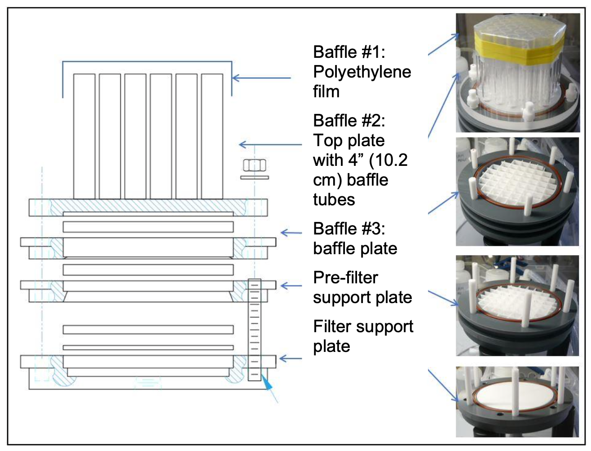

Figure 1. Schematic of mini-MULVFS holder with pictures of the baffle and filter support plates (Bishop et al., 2012). The baffle logic follows that of the main MULVFS filter holder (Bishop and Wood, 2008), with design to facilitate mounting on McLane pumps and handling in the laboratory. A commercial version of this holder is available through McLane Research Laboratories (East Falmouth, MA). 

Understanding the variability of POC on a wide range of spatial and temporal scales is not possible through discrete measurements alone. Optical sensors capable of measuring ecologically relevant ocean parameters have greatly expanded knowledge of oceanic biogeochemical processes. Particle abundance, and thus POC, present in the ocean’s surface layer is amenable to remote sensing from its absorption and scattering properties. POC is currently a standard NASA ocean color satellite data product estimated using a blue-to-green band ratio of remote-sensing reflectance (Stramski et al., 2008). The error inherent to the in situ measurements used to tune POC algorithms has not been fully assessed. PN is not suitable for remote detection with current technologies; however, measurement from in situ autonomous platforms has been proposed using an optical proxy based on the particle backscattering coefficient at 700 nm (Fumenia et al., 2020). Different approaches, particularly for sampling, filtration, and blank corrections, introduce biases and errors in the final measurement of POC (Gardner et al., 2003; Cetinić et al., 2012; Novak et al., 2018). The lack of a uniform consensus protocol precludes a complete assessment of algorithm uncertainty and the accuracy of satellite data products. Supporting satellite algorithm development and data product validation activities requires generating those field measurements with a documented uncertainty in keeping with established performance metrics for producing climate-quality data records (Hooker et al., 2007).

For these reasons, NASA supported a workshop at Goddard Space Flight Center (GSFC) from November 30–December 2, 2016, to develop a consensus methodology for measuring POC and PN that meets current and future ocean color satellite mission requirements. The objective was to produce community consensus protocols under the auspices of the International Ocean Colour Coordinating Group (IOCCG) for POC sample collection, filtration, storage, analysis, and quality assurance appropriate for satellite algorithm development and validation. The hope is that the protocols presented here can be widely adopted by the academic scientific community engaged in ocean C and N cycle research, particularly those in activities that support ocean color validation. We cover in great detail all the steps needed to produce high-quality data and briefly summarize the recommendations in Appendices A1-A11.

# 2. Sample Collection

## 2.1 In situ Pumps

In situ pumps are used for larger volume filtrations—hundreds to thousands of liters of seawater—of particles in situ that can be collected onto filters of different sizes allowing for size-fractionated sample collection. In situ filtration systems use either ship power (e.g., Multiple Unit Large Volume In situ Filtration System (MULVFS)) or battery power (e.g., McLane Large Volume Water Transfer System and the Challenger Oceanic Stand-Alone Pumps (SAPS); Bishop et al., 2012; McDonnell et al., 2015) to operate pumps at specified depths to filter water in situ, typically for 2–4 hours. Ship-powered systems have a dedicated electro-mechanical line with fixed depth intervals onto which pumps are connected (Bishop et al., 1985). Battery-operated pumps can be attached to many types of hydrographic lines at user-defined intervals.

The MULVFS maintains a constant pressure differential across the filters during pumping, leading to a decrease in flow rate over time as the filters clog. In contrast, the McLane in situ pumps initially maintain a constant flow rate during filtration, leading to an increasing pressure differential across the filters as they clog until some pressure threshold is reached. After this, the pump firmware automatically decreases the flow rate. Although most in situ pumping systems cannot monitor the pressure differential across the filter during pumping, McLane pumps can be set at different initial flow rates. In an intercalibration study, Maiti et al. (2012) found no difference in particulate 234Th activities collected on 0.45 µm pore-size polyethersulfone or 1 µm pore-size quartz fiber filters as a function of initial flow rates that ranged from 2–9 L min-1. However, the authors found a linear decrease in large (>51 µm) particulate 234Th activities with increasing flow rate. This result that was also observed for >51 µm particulate trace elements collected by MULVFS (Bishop et al., 2012), presumably due to increasing fragmentation of large, fragile aggregates through the 51 µm mesh filter with increasing flow rate.

Besides a sensitivity to flow rate, the accurate collection of large particles by in situ filtration is also susceptible to filter holder design (Liu et al., 2009; Bishop et al., 2012). Filter holders with a central, small-diameter inlet have high intake velocities that are more difficult for zooplankton to escape, resulting in higher sampling of zooplankton and thus typically higher POC. Most in situ pump filter holders have a more diffuse intake that swimming zooplankton can avoid and some sort of baffle system above the top-most filter stage to minimize washout of particles from the filter upon pump recovery. Bishop et al. (2012) found that many commonly used filter holder designs with baffles < 5 cm in height still led to particle loss compared to designs with 10 cm tall baffles. The use of appropriate filter holders is thus essential for accurate sampling of particles and POC by in situ filtration[^1] (Figure 1).

The large volumes filtered by in situ systems allow for size-fractionated filtration using filter holders with multiple stages, including the sampling of rare, large particles, and sampling for multiple analytes if particle distribution on filters is uniform enough so the filter can be sub-sampled representatively (e.g., Bishop et al., 2012). Some in situ filtration systems are adapted to meter several flow paths at once, allowing for the simultaneous collection of particles onto different filter types on parallel filter holders. For example, determining biogenic silica and POC requires particle collection on two filter types: a plastic membrane filter for silica and quartz or glass fiber filters for POC (e.g., Lam and Marchal, 2015). Finally, the large volumes filtered help overcome errors due to insufficient material on the filters, which may occur in oligotrophic surface waters or deeper (mesopelagic or bathypelagic) waters.

[^1]: A remarkable agreement was observed between upper 1000 m POC concentrations collected on paired quartz fiber filters in the central Equatorial Pacific at 12°S, 135°W by MULVFS during the EqPac JGOFS cruises in 1992 (Bishop, pers. comm.) and concentrations collected by McLane pumps during the GEOTRACES program (http://www.geotraces.org) 2013 GP16 cruise at nearly the same location (Lam et al., 2018). This agreement occurred despite two decades of separation in sampling using different in situ pump systems with different flow rate characteristics. Sample handling and analytical protocols were similar and show that consistent protocols can result in reproducible POC data by different investigators, even in oligotrophic and mesopelagic zones (Lam et al., 2018).

## 2.2 Shipboard Underway Systems

Modern oceanographic research vessels have underway “uncontaminated water” systems for science applications. These allow continuous access to surface water while underway or on station and the establishment of continual, automated measurement systems. Underway measurements continue to provide valuable contributions of high-resolution datasets using automated oceanic and atmospheric monitoring systems (Smith et al., 2010). However, one must pay attention to the design and maintenance of such systems to guarantee that the measurements obtained are within an acceptable accuracy threshold. In large, global-class vessels, plumbing lines might run for tens of meters from intake to the point of observation, potentially altering the sampled water’s physical, chemical, and biological nature during transit.

Underway systems allow for the easy manual collection of surface water samples, which can be processed and analyzed as described in Sections 3-5, without the need to stop the ship and occupy a station. The resulting data can be directly correlated to navigation and in-line sensor data using collection timestamps, facilitating the mapping of POM distributions and exploration of their relationships with various in situ optical variables (e.g., chlorophyll a fluorescence, particle beam attenuation, cp, and scattering). Readers are encouraged to consult Boss et al. (2019), which is part of this protocol series, for recommended best practices in using underway systems to measure inherent optical properties (IOPs), which are applicable to particle sampling for biogeochemical studies. Particular attention should be given to biofouling growth from inadequately maintained systems that could change the particle composition. Pressure differentials and turbulent shear forces can disrupt particle aggregates or burst phytoplankton cells and bias estimates of phytoplankton biomass (e.g., Slade et al., 2011; Cetinić et al., 2016). While some authors have found measurements of particles collected via surface underway systems comparable to those using other techniques (e.g., Westberry et al., 2010; Holser et al., 2011), current recommendations favor less disruptive pumping technologies (SCOR Working Group 154, 2020).

### 2.2.1 Automated Underway Filtration Systems

A major constraint of manual sample collection via underway systems is the effort required to sample and process samples at high frequencies. For some specific applications, such as measuring trace elements or bio-optical measurements, researchers have relied on custom systems that either substitute or work in tandem with a ship’s built-in system (e.g., McDonnell et al., 2015; Cetinić et al., 2016, Boss et al., 2019). Relatively novel custom set-ups, such as the semi-automated filtration system (SAFS) for collecting particulate samples from shipboard underway systems, are now used to investigate POM distributions in surface waters at high resolution in a variety of marine settings (e.g., Holser et al., 2011, Goñi et al., 2019). Goñi et al. (2019) provide a full description of the SAFS; in brief, it consists of collecting samples of measured volumes of water at predetermined intervals. The SAFS is designed to be connected directly to the ship’s surface underway system and uses the flow and pressure in the line to push water through filters to collect particles (Figure 2). A flywheel flow meter placed in-line and connected to a laptop computer enables the measurement of flows during the filtration stage, and the determination of total volume passed through each filter. A switching valve with multiple ports is placed downstream from the flow meter and controlled by the computer. 

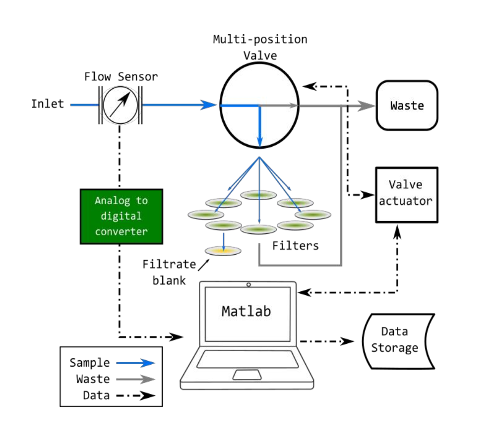

Figure 2. Schematic of the semi-automated filtration system (SAFS; Goñi et al. 2019). See Section 2.2.1 for description of components and mode of operation.

During operation, flows are set to fall within the linear range of the flow meter (20-100 mL min-1), while on stand-by, water is directed to the ‘waste’ port. Sample ports are fitted with quick-turn sockets and in-line stainless steel filter holders (13 or 25 mm). Each holder contains one pre-combusted glass fiber filter supported by a stainless steel screen and locked into place with a Teflon O-ring that prevents leakage. Once started, the filtration program directs the water flow to specific filter holders at selected intervals and time periods or prescribed volumes. Under typical conditions, the system is programmed to collect a sample every 20 minutes during a four-minute interval, resulting in a total filtered volume of ~300 mL given flows of ~80 mL min-1. Flow rates through the filter, which are monitored continuously during the filtration process, decrease steadily as particles clog the filter and impede flow, potentially altering the particle retention characteristics of the filter membrane. For this reason, the filtration program includes a minimum flow threshold (typically 20 mL min-1) below which the filtration process is stopped. 

Each sample is timestamped with the start and end of filtration with the ship’s time feed to allow retrieval of geolocation and other relevant oceanographic data for each sample. During normal operations, filter holders can be stacked at specific positions to collect particles from a sample using the first filter, and collect the filtrate blank associated with dissolved organic matter (DOM) sorption as filtered water goes through the second filter (see Section 4). Although the system still requires periodic removal of samples and replacement of new filters, compared to manual filtration, it provides the ability to collect POC samples at significantly higher resolution without extensive operator intervention. SAFS has also been used in tandem with towed vehicles that pump water to the ship (Holser et al., 2011), allowing for the characterization of deeper water column regions.

## 2.3 Niskin Bottles

Niskin sampling bottles, either conventional or Go-Flo, are the most common water-sampling devices used in modern oceanographic work. Therefore, most of the direct in situ observations to date of POC available in data repositories such as the National Science Foundation (NSF) Biological and Chemical Oceanography Data Management Office (BCO-DMO; https://www.bco-dmo.org/), and NASA SeaWiFS Bio-optical Archive and Storage System (SeaBASS; https://seabass.gsfc.nasa.gov; Werdell and Bailey 2002), have been derived from bottle samples. These data create the foundation for current and future satellite ocean color algorithm development. Thus, standardization of POC bottle sample protocols was of high priority for this activity. Despite the broad suitability of Niskin bottles for water sampling applications throughout the water column, there are some limitations regarding their use for quantitative particle collection (Gardner, 1977). As soon as a water parcel is isolated within a sampling bottle, its particle content begins to settle. Thus, by the time a Niskin bottle arrives on deck for sample extraction—a process that can take several hours in the case of deep ocean casts—the concentrated particle distribution near the bottom of the bottle generates biases depending on when a sub-sample is extracted for particle quantification. Moreover, the sampling spigots on most bottles are located 3–4 cm above the bottom of the bottle, which precludes the extraction of water below that level, potentially leaving behind particles that settle below the point of extraction. Strategies to avoid, minimize, or account for these biases are discussed below.

Additionally, there is renewed concern about sampling errors with Niskin bottles, particularly those mounted on large rosette carousels (Paver et al. 2020 and references therein). Because modern systems allow automated bottle tripping once the desired depth is reached, there is a reduction in the ‘soak time’ in the targeted parcel of water before it is sampled. Under stratified conditions, the authors suggest soak times upward of 2–3 minutes can be necessary to representatively sample water at a given depth. Significant differences in salinity were found in casts performed with no soak time when compared to those allowed to equilibrate with the surrounding water at multiple time lengths. Entrained water by the carousel assembly during upcasts, when bottles are usually tripped, and incomplete bottle flushing may contribute to these errors. It is not known how the biases identified in salinity translate to errors in other biogeochemical variables, including particle abundance, given that many of them do not always vary in tandem with salinity. Nonetheless, researchers performing observations on Niskin samples for other chemical or biological quantities should factor in all these conclusions when designing their sampling strategies, particularly if the measured variables are correlated with salinity or otherwise dependent on the density field. The authors offered a summary of recommendations based on their results:

> (1) ensure the Niskin sampling bottle caps are fully cocked prior to deployment, (2) allow the ship to drift with the current while on station, (3) in moderate swells (greater than 1 m), allow at least three swells to pass while flushing the bottle at a given depth/pressure, (4) in quiescent waters, allow the sampling bottle to flush for up to 3 min, and (5) average sample values from the top and bottom of sampling bottle when in vertical gradients.” (Paver et al. 2020).

### 2.3.1 Subsampling, Dregs 

As stated in Gardner (1977), the most reliable solution for handling bias due to settling is to filter the entire volume of water, including water below the spigots—even if that requires multiple filters—and to sum the results (Gardner et al., 1985) or use smaller bottles. Neither approach is typically practical since water samples for multiple analyses are routinely needed from each bottle. In addition, extracting the water below the spigot requires removing a bottle from the rosette or opening the bottom of the bottle and using a funnel to collect the water into a sample bottle. The latter method provides many opportunities for contamination.

Another approach is to mix the water in the bottle thoroughly (this may be difficult with large samplers attached to a rosette), quickly draw a subsample, and filter the whole subsample. This method must be used after drawing gas samples (i.e., O2, CFCs) to avoid gas contamination by allowing a headspace to develop. A GEOTRACES approach is to mix a water sample after all other samples are drawn from the bottle and then sample for particulates. However, this method does not entirely solve the issue of rapid settling of large particles, and can still introduce some bias due to prior settling.

Scripps Institution of Oceanography attempted to install a spigot in the bottom end cap, but it proved impractical. More recently, spigots have been placed lower on many sampling bottles to minimize the dregs volume. Samples for salinity, oxygen, and other analyses not affected by particulate materials could be drawn from an additional spigot that does not remove the large particles that rapidly fall to the bottom. Still, particles settle to the very bottom of a bottle, so decreasing the dregs volume does not entirely solve the problem, but it can help.

Extra care must be taken during rosette retrieval in all conditions to avoid loss of water and large particles from the bottom closure of the sampler. Bottom closures must be tight, winch movements smooth, and bottle handling careful. Gardner et al. (1993) compared the in situ beam attenuation with the beam attenuation measured by inserting a transmissometer into a Niskin bottle immediately upon retrieval. To test for the effect of dregs on the correlation between optical measurements of particle concentration (beam attenuation coefficient of particles; cp) and particulate matter (PM) concentration, Gardner et al. (1993) plotted both regular and dregs-corrected PM concentrations against cp. Their fit between cp and PM generated a R2 = 0.91. The addition of dregs did not improve the correlation significantly (R2 = 0.93), but it did change the slope of the fit from 725 to 1024, indicating that the large dreg particles were not being sensed in cp. They also compared cp obtained by inserting a transmissometer directly into the water bottles after they were on deck with the cp recorded in situ through the CTD and reported good agreement between the two. Boss et al. (2009) found that the sensitivity of cp decreases rapidly for particles >20 µm. Therefore, Gardner et al. (1993) concluded that the best correlation for cp data is the one without a dregs correction, which indicates we do not have a good handle on the mass concentration of large particles in the ocean using standard optical parameters.

Suter et al. (2016) studied the differences in microbial communities above and below the spigots, which might not be expected to show any bias because their settling rate is very low as individual particles. They found significant differences in some microbial types associated with particles and minor differences in microbial types less associated with particles, concluding that microbes associated with particles settle as aggregates and then break up during sampling.

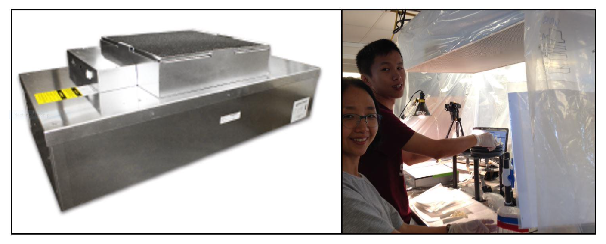

Figure 3. Left: MAC 10® LEAC 2x4 ft (600x1210 mm) fan filter unit (Envirco, Sanford, NC). Right: A bench-top bubble built over a standard lab bench on the R/V Oceanus to process in situ pump samples and conduct open-funnel filtration. A 2’x4’ MAC 10 unit is suspended from eyebolts on the ceiling, and plastic sheeting is draped from the filter unit and taped to the edges of the lab bench to create a clean environment. In this photograph, the open funnel filtration system is out of the frame on the right side of the bench. Anecdotal evidence from this cruise suggested that samples from open funnel filtration conducted outside the clean bubble had many more fibers than those filtered inside the clean bubble, probably due to contamination from the ship’s air handling system.

If the bottles are further subsampled, additional biases can be introduced depending on how this step is accomplished. Agitating a bottle and pouring its contents is an improvement over no agitation. However, this approach still generates varying concentrations in the subsample as influenced by the individual performing it and variations in how rapidly the contents are poured out. Experiments with three individuals filtering samples from replicate 3 L bottles (i.e., each individual accomplished all of their filtering from a single 3 L bottle) onto 25 mm and 47 mm filters demonstrated consistently lower total suspended solids (TSS; 14–22%) on the 25 mm filter compared to the 47 mm, with the difference seven-fold greater than composite sample mean deviation. This finding appears to be a function of the differences in the size of the filter towers (see Section 3.1.1), with the smaller 25 mm filter tower requiring slower and more careful pouring than the 47 mm filter tower, thereby allowing more time for particles to settle after agitating the 3 L bottle. Replication between individuals was better on the 47 mm filters as well (1% vs. 6% sample mean deviation as a percentage of the average), suggesting that artifacts introduced by this method can be reduced with sufficiently wide-mouth subsample containers to allow maximum pouring rates (Hernes, unpublished). On the other hand, more bias is likely with increasingly larger whole sample containers due to the challenge of keeping them continuously and sufficiently agitated. 

Subsampling can also be achieved by a variety of splitters. Simple designs include variations on a rocking splitter box with a divider that runs three-quarters lengthwise down the middle. The U.S. Geological Survey (USGS) developed two different devices, the churn splitter (Figure A1) and the cone splitter, and each effectively splits particulate samples without bias (USGS, 2006). The cone splitter was shown to split solids at concentrations ~200 mg L-1 with a precision of 7% or better for particles up to ~ 400 µm (Capel et al., 1995). Since the sample is split in its entirety, accuracy is better than precision. However, this device requires a stable and level platform and is not suitable for shipboard splitting. Churn splitting is suitable for particle sizes < 250 µm in sample volumes between 3 and 13 L, constrained by the dimensions of the available devices and the range of concentrations and particle sizes found in marine and estuarine samples; the approach has a reported accuracy and precision of < 2% (Horowitz et al., 2001).

### 2.3.2. Contamination Prevention

Water from Niskin bottles is unavoidably exposed to ambient air during sampling and filtration, making samples vulnerable to contamination from carbon-containing particles, such as soot from engine exhaust, clothing fibers, and other airborne contaminants. Operators must wear laboratory-grade, powder-free gloves during sampling and sample processing. A recommendation is to use closed, in-line systems in sampling and filtration (see Section 3.1.2) to reduce atmospheric exposure. Drawing samples directly into POM-dedicated bottles from the Niskin while covering the borehole with a filling bell (e.g., Nalgene DS0390-0070; Figure A2) and letting the sample overflow momentarily before capping to eliminate head space can help reduce contamination (Cetinić et al., 2012).

If open-funnel filtration (see Section 3.1.1) is used, exercise proper care to reduce exposure to contamination of the filtration apparatus and any labware that comes in contact with samples. Covering  these with clean foil or caps while not in use and during filtration can reduce contamination. All instrumentation and tools (e.g., forceps, graduated cylinders, towers, bases) should be rinsed with de-ionized water periodically and cleaned with a mild laboratory-grade detergent at the end of a sampling day.

Working in a high-efficiency particulate air (HEPA)[^2]-filtered environment (laminar flow bench, or “bubble”) is an effective way to keep samples free of contaminants. Researchers measuring trace elements and isotopes (TEIs) in water and particulate samples have adopted this approach as routine practice; it should be considered a potential strategy to reduce contamination in conventional POC and PN work in oligotrophic ocean regions where the introduction of foreign particles can induce a larger relative error. HEPA-filtered workstations are commercially available and typically sold as “PCR Workstations” but are often too small to fit many ocean-going filtration rigs. A more cost-effective and practical solution is a HEPA fan unit (e.g., MAC 10, Envirco, Sanford NC) hung above a lab bench, with plastic sheeting taped around it to create a bench-top sized, clean space (Figure 3).

[^2]: High efficiency particulate absorbing (HEPA) is an efficiency standard for air filters. Filters meeting the HEPA standard must remove from the air at least 99.95 % (European Standard) or 99.97% (ASME, U.S. DOE) of particles whose diameter is equal to 0.3 μm.

### 2.3.3. Pre-Filtration

POM is typically defined as all particles, including zooplankton or ‘swimmers,’ that can be retained on the filter. Thus, procedures for collecting seawater for filtration usually do not include pre-screening to exclude swimmers. Zooplankton contribution to POM is thought to be minor; however, if chemical characterization of the non-swimmer fraction is a study objective, without prefiltration, the organic composition can be biased due to the inclusion of zooplankton (Hurd and Spencer, 1991). This issue drew more consideration when the discrepancies between in situ pumps and bottles were examined, and biases due to differential zooplankton capture were hypothesized to lead to higher POC from bottles (Liu et al., 2005). Niskin or Go-Flo bottles are operated on snap-shut mode, so microzooplankton (20–200 µm) can be easily caught; in fact, bottle collection is a standard collection procedure for microzooplankton. In contrast, macrozooplankton (0.5–5.0 mm) may escape the inlet of in situ pumps when detecting fluid turbulence caused by flow. In particular, this may be the case for filter holders with diffuse intakes or at the end of the pump deployment when the flow rate slows significantly due to the filter clogging. Indeed, zooplankton (>70µm) abundances, mainly copepods and their nauplii, were at least one order of magnitude higher in bottles than in situ pumps with different holder designs (Liu et al., 2009, 2005). For example, at the Dynamique des Flux Atmospheriques en MEDiterranee (DYFAMED) site in the Ligurian Sea, it was determined that the zooplankton caught by bottles contributed 1–2 µmol L-1 (12-24 µg C L-1) to POC in the top 50 m (Liu et al., 2009).

Either Teflon (70 µm) or Nitex (53 µm) mesh can be used to pre-screen or size-fractionate for POM measurement, and these are also the sizes typically used with in situ pumps. U.S. GEOTRACES campaigns use 51 µm polyester mesh (Sefar Inc., Buffalo, NY) for its lower trace metal blank and greater open area than their 53 µm product. POM fractions of 0.7–70 and >70 µm can then be obtained. The larger fraction includes both swimmers and other particles. Whether to pre-screen will depend on the study goals, but the contribution of swimmers should be evaluated if measuring and characterizing bulk POC and PN is the objective.

# 3. Sample Processing
## 3.1 Bench-Top Filtration

Bench-top filtration is the most common approach for processing samples derived from bottles or other low-volume sampling techniques. It is the most straightforward approach for quantitative particle retention for POC measurement. However, that simplicity should not lead to complacency regarding methodological rigor. Adherence to best practices ensures that measurements are carried out according to the quality level that meets validation activities and requirements for climate data records or any other requirement objective. 

### 3.1.1. Open Funnel Systems

Open filtration systems commonly comprise a set of laboratory-grade glass filter-holder assemblies for 25 mm diameter filters (see Section 3.2; Figure 4), available from any major scientific supply vendor. The funnels should have a reservoir volume of ~ 400–500 mL so that sufficient sample water can be added during filtration and minimize the number of refills necessary to accomplish enough particulate retention. Filter bases should be fritted glass and set up with silicone stoppers for vacuum sealing and attachment to manifold or filtering flasks. The choice between a manifold and filtration flask for the setup depends on the approach used for filtrate blank correction (Figure 4; Section 4) and whether there is a need to recover the filtrate for subsequent use. There is a critical need to attain efficient, high-throughput sample processing during extended sampling campaigns at sea; this is difficult to accomplish solely with off-the-shelf components typical of onshore laboratory filtration. Research groups commonly create custom-built filtration setups to improve efficiency. These systems secure and accommodate the filtration hardware and allow the use of laboratory bottles to continually deliver sample water into the filtration apparatuses, thus minimizing biases due to subsampling (e.g., Section 2.3.1). Such setups are made of treated, water-resistant wood (e.g., resin-coated, marine-grade plywood) or other synthetic materials (e.g., polyacetal, Delrin®) with designs that depend on the needs of each research operation. Figure 5 shows examples of custom filtration setups.

### 3.1.2 In-Line Systems

Open funnels are a practical approach for filtering POM samples. However, some researchers suggest using closed, in-line filtration because samples are exposed to the air overhead, which can be a source of settling particle contamination. The operational principle is to enclose the sample in a volume-calibrated bottle that feeds into the system by a combination of gravity and vacuum pressure leading to an in-line filter holder via laboratory-grade tubing. Another reason for using this approach is reducing bubble formation during filtration, which has been suggested to lead to particulate matter formation from DOM (Menzel, 1966). This source of error can be minimized by an additional tube that allows filtered air into the bottle headspace to allow for pressure compensation as the bottle empties (Figure 6). These systems are custom-built and designed to each group’s specifications and needs. Figure 6 presents an example and schematics of an in-line filtration setup for sample processing.

## 3.2 Filter Type

POM measurements are made on glass fiber filters given their suitable inorganic matrix. Glass fiber filters are made by laying down a mesh of thin borosilicate fibers, the density of which leads to different effective pore sizes, sorted by different grades. Because a mesh of glass fibers creates the filters, their pore size is “nominal,” meaning their pore size cannot be specified accurately. There is significant literature on the retention efficiency of this broad category of filters (e.g., Li and Dickie 1985; Lee et al., 1995; Morán et al., 1999). There is no universally accepted filter type used in planktonic studies. However, it seems the filter grade used most commonly for particles (e.g., chlorophyll a analysis and POC filtration in 14C primary production incubations) is the glass fiber filter grade F (Moran et al., 1999). Grade F filters, commonly referred to as GF/F, are defined as “fine porosity, medium flow rate, with a 0.7 µm size particle retention.” While glass fiber filter grades are industry standards, there is a wide range of manufacturers; nearly all the major vendors have a glass fiber filter grade F equivalent. It is critical to compare filter types to understand any potential biases because there is no standard manufacturer. A small comparison (n=15) of GF/F and GF-75 (Advantec MFS, Inc. Dublin, CA; nominal pore size 0.3 μm) showed no significant difference in POC measured between the two filter types when 250 mL of sample water were filtered. POC in GF–75 filters had a positive mean bias of 0.52 μmol L-1 (6.3 μg C L-1) relative to those from GF/F filters. However, the differences were not significant at the 95 percent confidence level (Figure 7). Other research investigating the retention of bacterial cells with samples from several ocean regions, including the eutrophic Danish fjord, Baltic Sea, and the subtropical Pacific off Baja California, found that GF-75 retained more bacterial cells than GF/F (60% vs. 49% on average, respectively; Bombar et al., 2018). The latter results suggest that GF-75 filters collect more and presumably smaller particles.

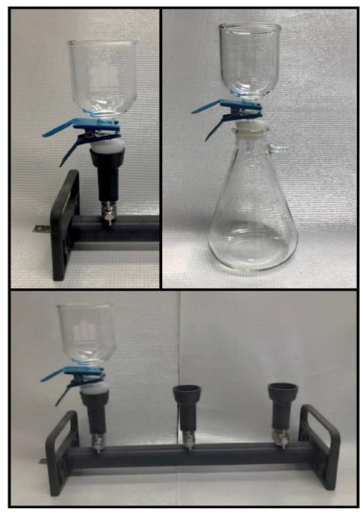

Figure 4. Open funnel filtration apparatuses. Top left: Borosilicate glass filtering funnel for 25 mm filters, 400 mL capacity, with fritted glass filter support (Kontes, DWK Life Sciences, GMBH). Top right: The same filtering assembly with 1 L filtration flask for collection of filtrate blank (see Section 4.2). Bottom: Filtration assembly showing detail of PVC three-port vacuum manifold (Thermo Fisher Scientific, 09-753-39A).

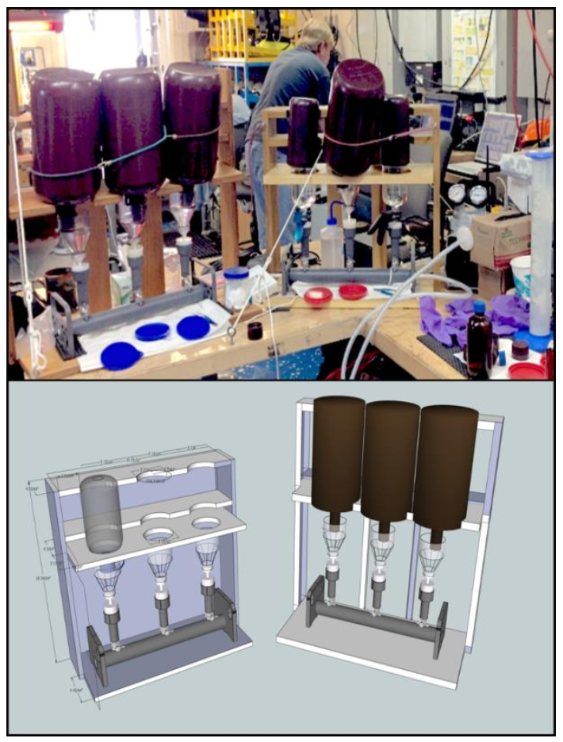

Figure 5. Top: Examples of custom, open-funnel filtering setups. Multiple rigs for phytoplankton pigment and POC filtration showing inverted laboratory bottles of different volumes used for sample delivery. Bottom: Schematics of filtering setups depicted in top row. The one at left is for 1 L bottles; the one at right is for 4 L bottles.

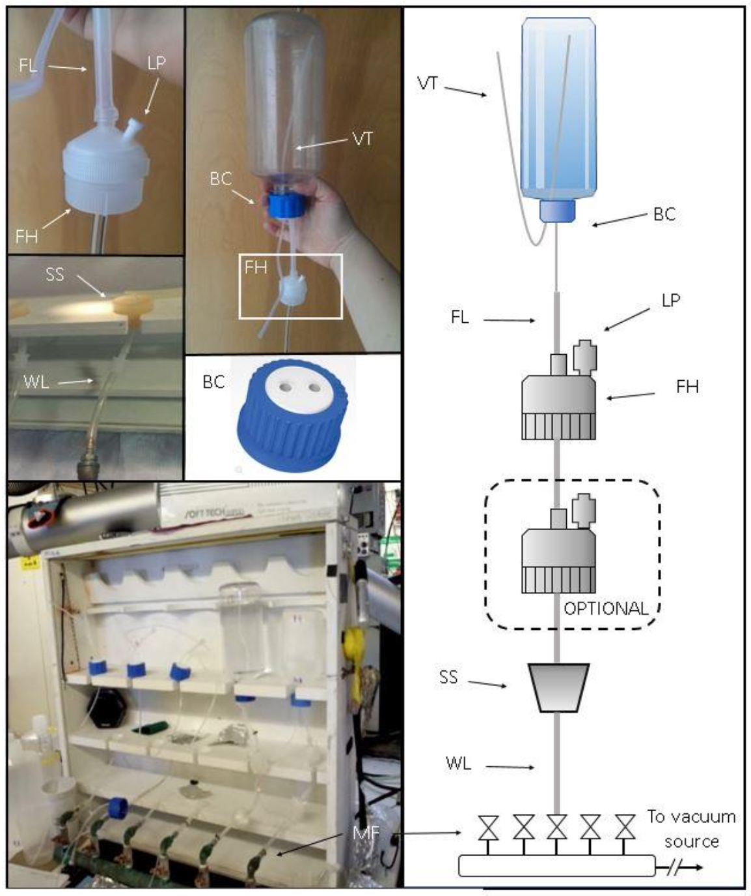

Figure 6. In-line filtration setup. Clockwise from bottom left: Wood filtration rig with vacuum manifold (MF); waste line (WL) with silicone stopper (SS) anchor; Swinnex 25 mm filter holder (FH) modified to accept a male Luer plug (LP) to flush out bubbles, silicone tubing 3.18 mm I.D. (1/8 in) feed line (FL); Nalgene polycarbonate 1 L filtration sample bottle with Diba Labware: T-Series, GL32, two-port bottle cap (BC), semi-rigid polyetherketone (PEEK) tubing  3.18 mm O.D. (1/8 in) vent tube (VT), and filter holder; detail of bottle cap. Right: Schematics of in-line system, showing an optional, second filter holder for filtrate blank collection. 

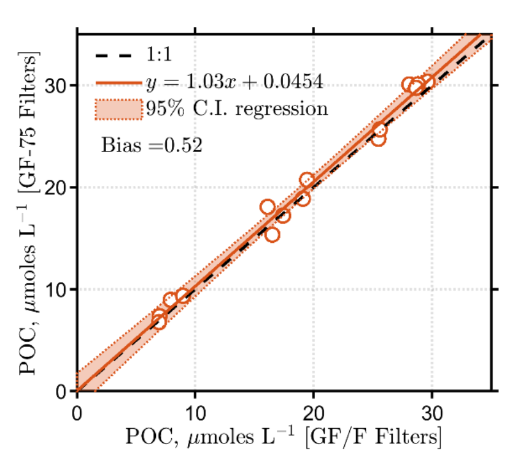

Figure 7. Particulate organic carbon (POC) measured on GF–75 glass fiber filters (0.3 µm–pore size) vs. POC measured on GF/F–type filters (0.7 µm–pore size) for near-surface samples (< 25 m) collected off the coast of Peru during R/V Sonne cruise #243. Filters were pre-combusted (450°C for 2 hours) before use. Filtrate blank correction (see Section 4) was obtained from filters with sample water filtered through a prior filter of the same type for each case and then re-filtered to make the blanks. The regression 95% confidence interval (C.I.) encompasses the 1:1 line, and thus the difference between filter types is not significant. Bias was estimated as  Source: (M. Lomas, unpublished data).

Measurement accuracy should be the primary driver of filter choice for quantitative POM studies. From that perspective, GF-75 filters should be the primary choice. However, one can argue that consistency in measurement is key. Therefore, the long-term time-series studies that relied on GF/F filters for decades would need to characterize the biases potentially introduced by a switch to filters with higher particle retention before a change is implemented. Regardless of filter choice, provided the filter is appropriate for quantitative POM work, the filter type should be explicitly stated in the metadata when reporting. Doing so will allow future data end-users to evaluate any potential biases or artifacts in individual observations and time series records (see Section 6.6).

For in situ filtration, quartz fiber filters (e.g., Whatman QMA) are a common alternative to GF/F filters for POM. These filters are similar to glass fiber filters but are available in only one effective pore size (nominally 1 μm). Quartz fiber filters are desirable in certain studies due to their lower blanks compared to glass fiber filters for many trace elements (Bishop et al., 1985) and short-lived isotopes such as 234Th (Buesseler et al., 1998). A direct comparison study showed that POC values do not differ significantly between QMA and GF/F (Liu et al., 2009).

A concern with glass fiber filters is cell leakage or breakage of fragile particles and therefore a loss of organic matter during filtration (e.g., Fuhrman and Bell, 1985; Collos et al., 2014), presumably due to the combined effects of pressure (see Section 3.4), sample loading, and needle-like microfiber ends. A recommendation is to adjust loading and filtration pressure to minimize particle loss. For example, to avoid saturation on GF/F filters, Rasse et al. (2017) proposed an empirical relationship between cp (m-1) at 650 nm and the maximum filtration volume (Vmax; L) given by:

$$V_{max} = 4.1 - 7.9 \times c_p(650)$$   (1)

The authors found this relationship predicted lower filtration volumes than those used in sample replicates that showed negative intercepts in the relationship of mass of carbon per filter vs. filtered volume used to correct for filtrate blank (see Section 4.1), which they attributed to increased filtration efficiency due to filter overloading (Rasse et al., 2017).

## 3.3 Filter Combustion

Glass fiber filters for POC, or any other quantitative POM-related work, must be combusted in a muffle furnace for a period of hours at a high enough temperature to remove any potential traces of organic matter contamination accumulated since manufacture or due to prolonged storage. We recommend 450°C for 4 hours, which is sufficient to eliminate any traces of organic matter in the filters without altering their physical characteristics. As a comparison, loss-on-ignition methods for measuring organic matter in soils use 360°C for 2 hours (Nelson and Sommers, 1996). For temperatures above those recommended, there is some evidence that pore size and filtration characteristics of GF/F filters could be affected. Nayar and Chou (2003) reported increased filtering efficiencies, equivalent to those of 0.3 µm pore-size membrane filters, for GF/F filters combusted at ~600°C for 1 hour, which they attributed to compaction of the glass fibers. The manufacturers of the GF/F and GF-75 filters recommend maximum use temperatures of 550°C and 500°C, respectively. 

For combustion, filters should be removed from their retail packaging and placed in aluminum foil pouches ideally containing a single filter (Figure 8; see Section 3.6)—or at most, as many filters as would be used in a period of hours while in the field. For storage and sample processing in the field, unused filters should be kept in the foil pouch used during combustion to prevent contamination and placed in a plastic storage bin or another airtight secondary receptacle.

## 3.4 Filtration Pressure

For bottle sample filtration, the suggested maximum vacuum or positive pressures reported in the literature vary widely (Table 1), and findings on the effect of pressure on the POM measurements are ambiguous. For example, the effect of pressure (17–83 kPa) was found to be small to negligible in deep samples (80 and 270 m), while for shallower samples, values decreased by 2–10 times at greater pressures (Gardner et al., 2003). Using natural samples and cultures of diatoms and flagellates, Liu et al. (2005) found no significant pressure effect (20–100 kPa) in POC, PN, or chlorophyll a results. While holding differential pressure constant and under low vacuum (< 13 kPa), Collos et al. (2014) detected cell breakage on GF/F filters at different carbon loading levels based on the phytoplankton species. The authors provided a literature review summary of “fragile” and “robust” phytoplankton species that relate to the prospect of cell breakage during filtration. It suggests that shallow samples with living phytoplankton cells—the most significant for satellite validation purposes—can be vulnerable to higher pressure during filtration in some instances; therefore, a standardized protocol must be established that minimizes cell breakage errors. Based on the range of pressures presented in Table 1 for POM filtration and other related parameters, 17 kPa (i.e., 0.17 atm; 0.17 bar; 5 in Hg; 130 mmHg; or 2.5 lb in-2, psi) is the maximum allowable pressure during sample filtration. That value should not be regarded as a recommended target but rather as a ceiling to avoid. The lowest pressure below that threshold that can be reasonably implemented for a given application is strongly encouraged.

Table 1. Used or recommended pressure across filter in various filtration protocols or method reviews for POM and other related parameters.

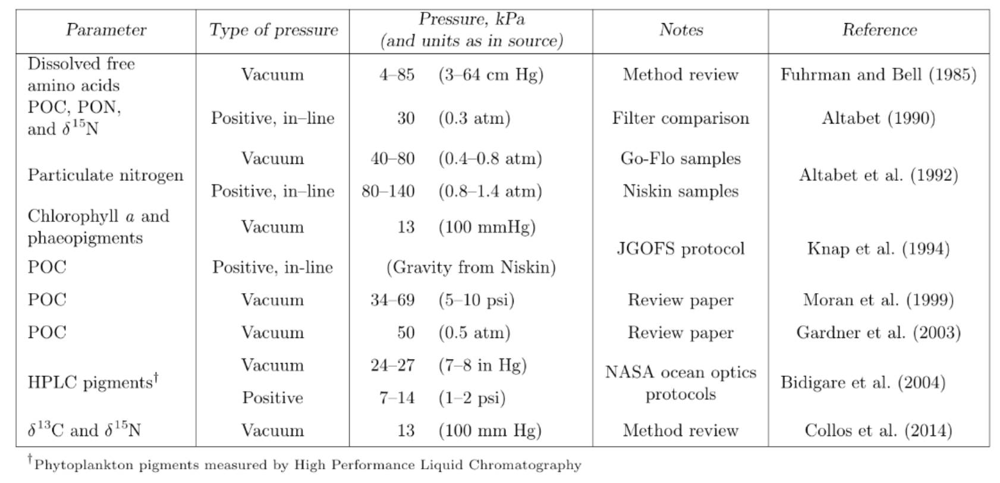

## 3.5 Replication

Precision is the measurement agreement among a set of sample replicates independent of any true value. It is a key performance metric to assess the uncertainty of any analytical procedure. Precision is estimated by means of multiple replicate analyses of independent, separate aliquots of the same sample. Proper measurement replication could involve samples from the same or different Niskin bottles if multiple bottles were tripped at the same depth close in time, or multiple surface bulk or underway-drawn aliquots. In practice, the independence requirement can be difficult to meet when water budgets are tight, or samples are logistically challenging to obtain. Nonetheless, every effort should be made to collect samples with higher replication for at least a subset of samples at every sampling station or location. Section 6.4 discusses the quantitative treatment of replicates and the estimation of precision as part of the uncertainty budget for the measurement of POC.

## 3.6 Sample Storage and Shipment

Samples must be appropriately stored to prevent degradation immediately after filtration. Most researchers opt for frozen storage (≤ −80 – −20°C, or liquid N dewars) and shipping to their home laboratories for further processing. However, some researchers dry samples at sea before storage and shipment. There are multiple choices for containers, which carry different advantages and disadvantages (Table 2). Containers must not present a risk of C contamination, and attention must be paid to those fabricated from any C polymer and their ability to withstand extended periods in cold storage. In general, it is best to avoid plastic storage containers. If plastic is used, due to the need to transfer samples into acid-resistant containers for the acidification step during laboratory processing, glass should be used (see Section 5.3). Glass containers have the advantage that they can be combusted (e.g., ~450°C for 4 hours) to remove any C trace. Caps should be Teflon-lined to avoid contamination from any other type of rubber material. Glass is not well-suited for frozen storage as it can become brittle or break. Glass vials should not be placed in a −80°C freezer as they can crack when thawed; use only in −20°C freezers. Glass vials are ideal for at-sea sample drying. Partially folded samples can be placed inside with a loose cap to minimize contamination in the drying oven and allow moisture venting. Once the samples are dry, caps are tightened and the samples can be stored and shipped at room temperature.

Heavy-duty aluminum foil has many advantages over other methods for storing and shipping POM samples. Foil is ubiquitous and easy to procure and can be used to combust, store, and ship filters before use at sea. One convenient approach is to store single filters in individually sealed pouches for combustion (Figure 8). Each filter remains protected from contamination until needed; the same pouch can be used for cold storage and shipment back to the laboratory for processing. Foil packages can be stored at a wide range of below-freezing temperatures and are suitable for liquid N storage if stored in a secondary container such as a nylon stocking. Shipping of samples for processing must not compromise sample integrity. Samples in cold storage must remain below freezing to prevent degradation during transit. If stored in liquid N, dry shippers[^3] are the best option for maintaining samples below freezing for up to a month during shipment. If this option is not available, expedited courier delivery in sturdy coolers containing dry ice and commercial ice packs can keep samples frozen for a few days. If samples were dried at sea, they should be protected from foreign particle contamination and humidity during shipping. The individual foil packets described above, in turn stored inside waterproof plastic containers, can keep samples dry and free from contamination.

It is also possible to fold and fit filters into the silver boat capsules used to pre-acidify and run elemental analyses. Goñi et al. (2019) described how they placed sample filters, filtrate-blank filters, and analytical blank filters (see Sections 4.2 and 6.2.3) into the silver capsules at sea, which fit nicely into microplate vial files that can be securely frozen, transported, and stored until analyses. The benefit of this approach, provided that the microplate material is not susceptible to acid during the PIC removal step (see Section 5.3), is that the folded filters are placed in the capsules used during pre-treatment and not removed at any stage until elemental analyses are complete. This method minimizes contamination arising from excessive handling of the filters or possible sample loss associated with pre-treatments in different containers. 

[^3]: Cryogenic storage containers where the vapor phase of the cryogen (e.g., liquid N or He) is absorbed into a hydrophobic matrix to minimize the risk of hazardous spills, making them safe for commercial shipping.

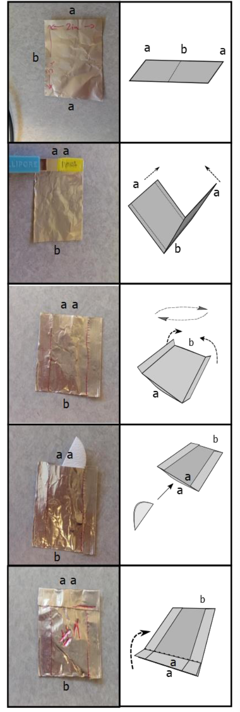

Figure 8. Assembly steps of aluminum foil pouches for single filter storage before and after sample filtration. Individual sample filters can be stored flat in a pouch sealed on all sides prior to combustion and kept there until use in the field. The pouch is then reused for sample storage and shipment after filtration. After filtration, wet filters must be folded in half, with the retained material on the inside of the folded filter. a: opening; b: bottom.

Table 2: Characteristics of common POC sample containers for shipment and long-term storage.

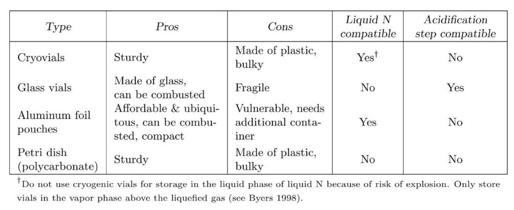

# 4. Filtrate Blank 

It has been known since the 1960s that POC and PN measurements have a significant filter blank (Menzel, 1966; Abdel-Moati, 1990). However, before the late 1990s, accounting for this artifact was not consistent (Moran et al., 1999). This issue earned more attention as a potential factor contributing to the observed differences in POC between bottles and in situ pumps (Gardner et al., 2003; Liu et al., 2005; Moran et al., 1999; Turnewitsch et al., 2007). Although there is agreement that, in most cases, the bulk of the signal from the blank is due to the adsorption of the organic forms of C and N onto the filter matrix during sample filtration, here it is referred to as a “filtrate blank” to acknowledge that other factors may add to the magnitude of the measured signal, such as sample manipulation and processing.

The magnitude of the filtrate blank error incurred can be large if no correction is applied for either element. Although the range of its relative magnitude varies due to multiple factors, it is not uncommon for the estimated “true” POC to account for only 10–20% of the total C measured in a filter sample from areas of the ocean where POC is low (e.g., Novak et al., 2018). Various approaches have been put forward to either minimize the error or provide explicit quantification so a proper correction can be applied. The simplest approach is to increase the volume of sample filtered, thereby increasing the ratio of “true” particulate C and N relative to adsorbed DOC and total dissolved N (TDN) in the sample filter. Logistical constraints might make this method impractical as tight water budgets and filter saturation may limit its applicability. Moreover, that strategy should not be construed as a true correction, as suggested by a modeling exercise by Turnewitsch et al. (2007). If uncorrected for filtrate blank, increase the sample size from 1 to 10 L to reduce the error from 100% to 10% in the measurement of a hypothetical true POC concentration of 1 µmol L-1 (12 µg L-1), where 1 µmol (12 µg) of DOC was adsorbed—a likely scenario in low POC regions—into a 25 mm diameter filter. Increasing the particle load on filters can induce cell breakage and leakage, thus decreasing the measured POC and PN value (Collos et al., 2014).

More common approaches involve exposing a filter to the DOM in seawater without particles by using two filters (i.e., in-line or by re-filtering filtrate) to filter samples and using the second filter as the filtrate blank (Gardner et al., 2003; Moran et al., 1999). And, in the case of in situ filtration, deploying an extra set of filters on the pumps but with the pump disconnected (e.g., Bishop et al., 2012), or by performing a regression of carbon measured per filter in different volume replicates versus volume filtered to derive a correction (Menzel 1967; Turnewitsch et al., 2007).

## 4.1 Regression-Based Corrections

One of the first indications that filtration for POC samples carried a significant filtrate blank associated with DOC adsorption occurred when the C content of multiple replicate sample filters was plotted against the filtered volume. The resulting linear regression contained a positive y-axis intercept, significantly different from zero (Menzel 1966). This result was interpreted as evidence that an amount of dissolved carbon, understood then as being independent of the filtered volume, was adsorbed onto the filter. This linear relationship and the application of regression analyses offered an approach to correct for the blank (Moran et al., 1999) and tools to understand the mechanisms behind this error. Figure 9 presents an idealized depiction of this relationship.

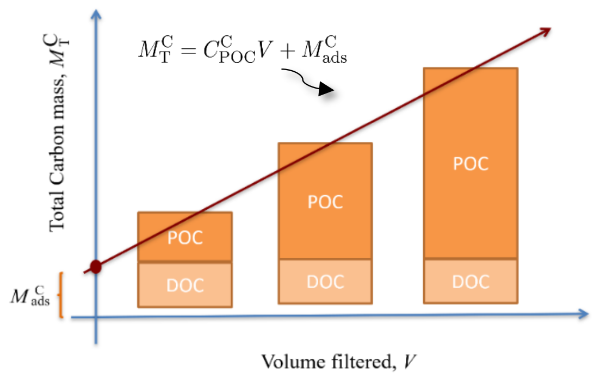

Figure 9. Total carbon accumulation per filter, $M^C_T$, vs. filtered volume for a hypothetical set of three POC sample replicates showing the linear relationship between V and $M^C_T$, while adsorbed C, $M^C_{ads}$, remains constant. The linear regression is the top central term in (1), where the corrected concentration of POC, $C^C_{POC}$, is given by the slope of the regression and the filtrate blank by the intercept, $M^C_{ads}$.

Turnewitsch et al. (2007) presented a theoretical and experimental assessment of the application of regression analyses to estimate the magnitude of the filtrate blank as part of a more comprehensive review of the discrepancies between bottle and in situ pump POC measurements. In this section, we build upon their work, adapting their methodology and notation to the discussion of this correction approach.

Consider a measurement of concentration, C, of any element retained on a filter (here developed for the case of carbon, denoted by the superscript ‘C’) for a sample of volume V, uncorrected for filtrate blank, where the observed apparent (subscript ‘A’) concentration,  can be expressed as

$$C^C_A$ = \frac{C^C_{POC}V + M^C_{ads}}{V} = \frac{M^C_T}{V}$$	(2)

where $C^C_{POC}$ is the carbon concentration due to POC alone, and $M^{C}_{ads}$ is the mass, M, of DOC adsorbed (subscript ‘ads’) onto the filter during sample filtration. $M^C_T$ is the total (subscript ‘T’) mass of adsorbed and particulate carbon retained on the filter. For this exercise, on the top central term in

$$C^C_A = \frac{C^C_{POC}V + M^C_{ads}}{V} = \frac{M^C_T}{V}$$	(3)

the mass of C from POC is expressed as a product of $C^{C}_{POC}$ and V (i.e., mass = concentration x volume). The purpose of that manipulation is so the term becomes a linear regression of the type y = mx + b, which describes $M^{C}_{T}$ as a function of V

$$C^C_A = \frac{mV + b}{V}$$	(4)

where m and b are the slope and intercept, which respectively are the corrected concentration of POC, $C^{C}_{POC}$, and the adsorbed C, $M^{C}_{ads}$, in (2). Two equivalent approaches derive from (3) to arrive at $C^{C}_{POC}$: One is to correct the total C measured, $M^{C}_{T}$, in each individual sample replicate by subtracting the regression intercept, b, and the other is to directly use the slope, m, as the value of $C^{C}_{POC}$. To implement this correction in typical oceanic or coastal bottle samples (i.e., ~ 0.5-4 L), a minimum of three replicates of different volumes must be processed for each observation so that a representative regression curve can be calculated, such as the one depicted in Figure 9. For example, the largest volume replicate should be at least three times the volume of the lowest, with an additional one in the middle of the volume range. The regression curve can also be applied to the detection of anomalous replicate observations. If a replicate deviates markedly from the regression curve, or contributes to a negative intercept, that observation can be flagged or removed from the final POC or PN value calculation.

The analysis above is predicated on the assumption that the adsorption of DOC or TDN onto the filter is nearly immediate and remains constant and independent of the volume filtered. However, various studies provide evidence for contrasting scenarios regarding the volume dependency of DOC adsorption. In experiments by Turnewitsch et al. (2007), regression analyses of uncorrected POC and PN retention on 25 mm filters versus volume for deep (1975 m) and near surface (4.5 m) samples showed that the material retained early during filtration was a N-enriched fraction of the DOM, while the C:N ratios of the material retained later during filtration were more typical of POC. The implication is that the material retained early on the filter was N-enriched, which was more likely to saturate active adsorption sites on the glass fibers early during filtration. For example, experiments with pre-filtered surface water from diverse locations by Novak et al. (2018) showed that even though DOM adsorption occurred early at a much higher rate, the process had a volume filtered dependency until a saturation point was reached. Despite the diverse origin of their experimental samples, all showed a consistently similar pattern of DOM adsorption as a function of volume filtered. An exponential model with a saturation term fitted to their data performed better than a linear one when describing that relationship. The model has the form

$$M^{C\*}_{ads} = M^{C\*}_{max} x 1-exp(\frac{-aV}{M^{C*}_{max}}) + b$$	(4)

Where $M^{C*}_{ads}$ is the adsorbed mass of C as in (2), but uncorrected (superscript $*$) for the blank signal due to the filter itself, usually known as a ‘dry-filter’ blank (i.e., unused filters processed as samples; see Section 6.2.3), denoted by the y-intercept term $b$. The term $M^{C*}_{max}$ is the adsorption saturation term (subscript ‘max’), also uncorrected for dry-filter blank, and a is the slope of the exponential phase, both derived from the regression fit. Novak et al. (2018) fitted the model in (4) to each sample experiment and to all samples combined as a training dataset to develop a ‘global’ exponential model, which was then validated on a subset of experimental data not used for model development. The purpose of their exercise was to develop a possible first approximation approach for correcting historical POC datasets for which filtering volume data is available, not to provide a routine correction approach for new measurements. For the latter, the linear model presented here is preferred. Novak et al. (2018) evaluated their model on $M^{C}_{ads}$ validation datasets from diverse DOM characteristics and found that it described adsorption better than a linear model. Additionally, they performed an adsorption experiment using a Suwannee River Fulvic acid II (SRFA) solution, a reference material issued by the International Humic Substance Society (https://ihss.humicsubstances.org/). The SRFA exponential fit was a low outlier relative to those fitted to the natural samples, suggesting that its chemical nature affected its adsorption potential onto the filters. Experimental evaluation of fulvic acid adsorption onto C various materials has shown that it is highly dependent on the content of polar moieties and pH (Yang and Xing 2009). This relationship between the nature of DOM and its capacity to bind onto glass fiber filters should be considered when assessing blank correction strategies, given that it is likely that the binding capacity of near-surface DOM may differ from that of deep sea samples. Organic-bound N is often charged and relatively polar. Thus, N-depleted deep-sea DOM relative to that in the surface ocean (Benner, 2002) may result in lower adsorption potential for deep-sea DOM. Glass fiber filters are composed of pure borosilicate glass, which contain numerous Si-OH active sites on their surface that can bind to polar substances via hydrogen bonds with amines found in proteins and other N-bearing organic molecules.

## 4.2 Filtrate Blank Filters

An alternative correction for the filtrate blank is to measure it directly on a secondary filter. For open funnel systems (see Section 3.1.1), the filtration system must accommodate for the quantitative collection of the filtrate in a C-free container, such as a glass filtration flask. The entire amount of the filtrate is then re-filtered under the same conditions as the primary sample on a separate filter, which is processed and analyzed as a regular sample to provide a direct measurement of $M^{C}_{ads}$. Simply wetting the filter in the filtrate to generate the blank is discouraged, given its dependence on filtration volume (see Section 4.1). 

For in-line systems, the equivalent approach is to place a secondary filter downstream and use it as the filtrate blank. Stacking filters directly on top of each other is not recommended as this affects filtration rate, pressure differential across the filters, and the retention efficiency of particles on the top filter. Given the possibility that samples from different water masses with distinct DOM compositions may display variable sorption characteristics, it is recommended to carry out as many filtrate blanks as possible, ideally one for each replicate. A benefit of the direct measurement approach, especially when performed at relatively high sampling frequencies, is that vital information can be gained on the DOM sorption characteristics of different water masses. This knowledge can improve blank corrections across the scientific community. One example of this approach is highlighted by Goñi et al. (2019), who used SAFS in combination with the ship’s surface underway system to measure POC distributions along the Bering, Chukchi, and Beaufort Seas in October 2012. Figure 10 illustrates the sampling coverage for POC determination using the SAFS aboard the USCGC Healy during that campaign. The red and blue dots represent samples collected using 13 mm GF/F filters during the outgoing and returning legs of the cruise, with specific dates and locations identified. Volumes filtered ranged from 150 to 400 mL per filter, with the larger volumes collected in regions of the Beaufort Sea where surface POC concentrations were lowest. The lower panel shows filtrate blank data in units of µg carbon in blank filter per mL of water filtered for a subset of samples where a second filter holder was added downstream from the sample filter to collect the blanks. A total of 670 POC samples were collected during the 20-day cruise, with 84 of those samples having filtrate blank measurement (~13% of samples). 

The amount of carbon in filtrate blanks per volume filtered ranged from < 0.02 to 0.07 µg C mL-1 and an average of 0.03 ± 0.01 µg C mL-1. The authors identified a spatial trend indicating higher blanks in Bering Sea waters—and in the Chukchi Sea later in October—relative to their Chukchi and Beaufort Seas counterparts. Based on those observations, the authors applied a correction by fitting the filtrate blank data for C and N with a third-order polynomial as a function of time (days in October 2012). The fit and the 95% confidence intervals are shown in (Figure 10; N data not shown). That empirical fit was used in combination with the volume filtered to calculate the amount of C and N associated with filtrate blank in each filtered sample. Those amounts were then subtracted from the measured values. This approach captured the variability related to water masses regarding DOM adsorption and applied those measurements to provide corrected estimates of POC and PN concentrations (Goñi et al., 2019)

## 4.3 Dipped Blanks from in situ Filtration

Dipped blanks are a set of filters deployed during in situ pump casts as sorption and process blanks (e.g., Bishop et al., 2012; Lam et al., 2015). Dipped blank filter sets are pre-filtered (with a 0.2 µm-1 µm pre-filter, depending on deployment method) to exclude particles and exposed to seawater for the duration of the pump operation, typically many hours. Dipped blank filter sets can thus be expected to represent “saturated” filtrate blanks. On U.S. GEOTRACES cruises, a set of dipped blank filters is deployed on every in situ pump cast (Lam et al., 2018; Lam et al., 2015; Xiang and Lam, 2020). Due to the different methods of exposure to seawater compared to the regression and filtrate blank methods noted above, the measured C is normalized to the filter area. The mean ± 1 standard deviation adsorbed C of 91 dipped blank filters from three cruises was 0.3 ± 0.2 μmol cm-2 (4 ± 2 μg C cm-2), with cruise-specific values of 0.11 ± 0.07 μmol cm-2 (1.4 ± 0.8 μg C cm-2; n = 8) from the eastern subtropical North Atlantic (GA03 cruise, leg 1), 0.3 ± 0.2 μmol cm-2 (4 ± 2 μg C cm-2; n = 44) from the eastern tropical South Pacific (GP16 cruise), and 0.3 ± 0.1 μmol cm-2 (4.1 ± 1.5 μg C cm-2; n = 39) from the Western Arctic (GN01 cruise).

For comparison, filtrate blanks found by Goñi et al. (2019) in the Bering, Chukchi, and Beaufort Seas (Figure 10), converted to comparable units by assuming an average of 300 mL of filtrate onto a 13 mm GF/F filter with an active filtration diameter of 12 mm, the mean ± 1 standard deviation was 0.7 ± 0.3 μmol cm-2 (8 ± 3 μg C cm-2), which is similar in error to the in situ pump dipped blank values on QMA filters from the GN01 cruise in the Western Arctic.

The GA03 dipped blanks from the eastern subtropical North Atlantic were significantly (t test; p < 0.05; Lam et al., 2018; Lam et al., 2015; Xiang and Lam, 2020) lower than those from the Western Arctic and lower—though not significantly—than those from the eastern tropical South Pacific. Although there were far fewer observations from the North Atlantic, it is interesting to note that surface DOC concentrations are noticeably lower in the North Atlantic than in the tropical Pacific or Arctic (Hansell et al., 2009), consistent with the idea that absorbed C blanks will scale according to quantity and perhaps quality of DOC.

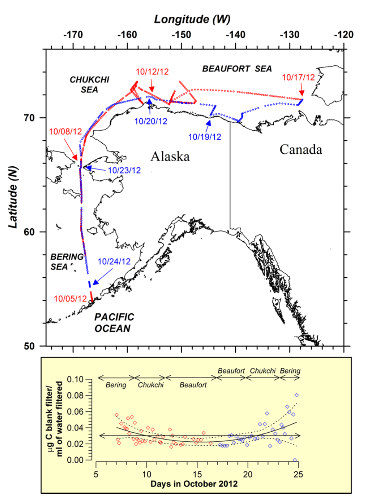

Figure 10. Map showing sample distribution during the HLY1203 cruise with the insert showing the amount of carbon in filtered seawater blanks as a function of days of the cruise. The polynomial fit of µg of C mL-1 filtered data is shown along with the 95% confidence intervals (µg C mL-1 = 0.08053 – 0.007155 x + 0.0001947 x2 + 1.575x10-6 x3; where x = days in October 2012).

## 4.4 Measurement Precision: Filtrate Blank Filters vs. Regression Correction

There is no obvious universal filtrate correction approach for bottle samples due to various considerations that are unique to every sampling campaign. The ultimate choice may come down to logistical concerns. Because true accuracy cannot be assessed with natural samples, one useful performance metric to compare and evaluate both approaches is the precision among sample replicates as measured by the coefficient of variation (CV%) for each measurement. For example, POC and PN replicates collected during the GO-SHIP P06 Leg 2 2017 campaign corrected with the regression approach (POCReg, PNReg,) had higher coefficients of variation than those generated using the blank filter correction (POCFilt, PNFilt,). Median CV% for POC and PN corrected by regression were 12.3% and 34.2%, respectively, versus 8.34% and 10.3% for those corrected by filtrate blank filters collected using a closed, in-line filtering system (Figure 11). These results are not generalizable to other datasets; practitioners are encouraged to assess which correction approach is more appropriate and yields the best result for their application.

Figure 11. Histograms of coefficient of variation (CV%) of the precision among sample replicates for POC, PN samples collected during the GO-SHIP P06 Leg 2 2017 campaign corrected for the filtrate blank by using (a, c) a blank filter ($POC_{Filt}$, $PNF_{Filt}$), or (b, d) a regression correction ($POC_{Reg}$, $PNR_{Reg}$). Vertical line denotes the median CV%, $\hat{x}$CV%.

# 5. Sample Processing for Elemental Analysis
## 5.1 Filter Sub-Sampling

The GEOTRACES program has produced validated methods (Cutter et al., 2017) for various aspects of sample acquisition and processing for TEIs, including those measured in particulate samples. There are recommendations therein for sub-sampling filters derived from in situ pumps (see Section 2.1). The pumps are commonly deployed for the measurement of multiple TEIs, in addition to POM. Here we summarize the procedures that apply to the latter; researchers measuring multiple elements should consult the latest version of the GEOTRACES cookbook (https://www.geotraces.org/updated-sampling-and-sample-handling-protocols-for-geotraces-cruises-cookbook/).

Filters of the QMA type can be sub-sampled with hole-punchers consisting of sharpened polycarbonate or acrylic tubing of the required diameter if concurrent trace metal sampling is being conducted. Sharpened metal tubes are preferred for POC work; a machinist can sharpen stock tubes to the desired diameter. Commercially available sterile biopsy punches (up to 12 mm in diameter) made of surgical stainless steel are convenient. Inexpensive commercially available metal leather punches can be used for larger diameters, but the machine grease must be cleaned off before use. Hole-punching has the advantage of creating subsamples of reproducible area. Filters can also be sliced with a sharp blade, though this method generally leads to more variability in the sub-sampled area. A rotary ceramic or steel blade works well for cutting straight lines without the need to place a straight edge directly on the sample, especially if the filter is deftly placed over a carefully drawn template to guide cutting. All sub-sampling where TEIs contamination is a concern should be done over acrylic sampling plates. For all other analyses, use heavy-duty aluminum foil or glass surfaces. Rinse surfaces with ultra-pure deionized water in between samples and discard once they become marred by repetitive use.

Sub-sampling on smaller filters (i.e., 47 mm) can also be accomplished with handheld paper hole punches (~6 mm diameter) if the filter is not overloaded to the point that particulate loading begins to flake. The geometry of different filter towers frequently leads to different effective filtration areas on the filters (diameters can vary by >4 mm), so custom diameter measurements may be required on every filter. No statistical difference was noted for four vs. six holes punched in a filter. Comparisons between hole-punched 47 mm filters and 25 mm filters analyzed in their entirety varied by <10% (Hernes et al., 2020).

## 5.2 Drying

Before analyses, samples are commonly dried in a clean oven used exclusively for that purpose and then placed in glass vials or covered petri dishes that have been combusted at 450°C for ~4 hours. Drying time should not exceed 24 hours. The temperature must be maintained in the range of 55 ± 5°C to minimize loss of volatile organic C from the sample. Rosengard et al. (2018) evaluated the effect of drying temperature on coastal POC samples (Woods Hole, MA) collected with in situ pumps and found no difference in terms of sample C and N bulk composition (i.e., elemental and isotopic abundance) between those dried at a room temperature of 56°C and those freeze-dried. However, they found loss in the lipid fraction in the oven and air-dried samples relative to the freeze-dried ones; yet this effect was not significant enough to affect bulk elemental abundance measurements. It is not known how this lipid loss may affect the measurement of POC in samples from other oceanic provinces. The main factor explaining lipid content of phytoplankton is taxonomic community composition, with flagellates and diatoms yielding higher content and cyanobacteria lower content (Galloway and Winder 2015; Jónasdóttir 2019). Thus, oceanic samples with higher proportions of POC derived from cyanobacteria, relative to diatoms and other groups, are less likely to be affected by this loss of C. Nonetheless, wider adoption of freeze-drying for sample drying should be encouraged to minimize this type of occurrence. 

For bench-top filter samples using GF75 filters (see Section 3.2), Novak et al. (in prep) found the magnitude of the blank for the drying step ranged from 6–13 μg C for filters placed in a gravity convection oven at 50°C for nine days. The blank was measured approximately every two days during the experiment for each of two treatments: filters through which 100 mL of deionized water were filtered and dry filters. No significant difference between treatments was found; however, the blank increased linearly with time for both treatments at ~0.4 μg C d−1.

## 5.3 Removal of Inorganic Carbon

Total particulate C is comprised of both organic and inorganic fractions. To properly quantify the organic component of that pool, any inorganic C must be removed from the sample. Removal is typically carried out by acidifying the sample, either by exposing it to acid fumes or by adding a dilute acid solution aliquot. Little is known about the magnitude of the blank or its effect on precision for this procedural step. An inter-calibration exercise among laboratories analyzing total and organic C and N in settling particles collected with sediment traps found higher variability for samples analyzed for organic C over those for total C (King et al., 1998). The authors hypothesized that this higher variability arose from errors introduced during the acidification step and not from the lower organic C concentrations measured, given that for a set of sediment samples also analyzed in that exercise with comparable total C concentrations, the precision among laboratories was better. These results emphasize the need to properly account for any blank that may arise during this processing step, and minimize errors due to organic C loss or incomplete inorganic C removal. A comparison of acidification methods by the type of acid used (i.e., HCl, H2SO4, and H3PO4) found that those using sulfuric acid were more prone to volatilize organic matter (King et al., 1998). Novak et al. (in prep) found no significant differences using 12 M HCl fumes for 24 hours vs. 0.25 mL of 1.2 M HCl onto GF-75 filters for samples of diluted cultures of CaCO3 lith-forming Emiliania huxleyi and the flagellate Dunaliella sp. It is important to note that the acidification step can result in the potential hydrolysis of acid-reactive molecules such as proteins, leading to losses from the sample filter matrix. One benefit of exposing samples to acid in the same receptacle (e.g., silver boat) that is used to carry out the analyses is that such potential losses are minimized (see the application of this method to sediments by Hedges and Stern, 1984).

Other considerations with sample acidification are the effects on PN, stable C and N isotope, and radiocarbon measurements. Current recommendations when measuring $\delta ^{13}$C and $\delta ^{15}$N in POM samples are to perform $\delta ^{15}$N on non-acidified samples due to measurable changes in N isotope ratios due to acidification (Carabel et al. 2006). Brodie et al. (2011) examined both rinsing and fuming of aquatic and terrestrial organic samples with HCl and H3PO4. The authors concluded that the HCl rinse technique directly in combustion capsules provided the most consistent results for bulk POC and PN abundance. The fuming method with HCl did not provide as consistent or accurate results. In a study of carbonate removal in coastal sediments, Komada et al. (2008) determined that fuming sediments with HCl over 24 hours provided accurate organic C, $\delta ^{13}$C, and Δ14C compared to the addition of 1 N aqueous HCl to the samples. Hernes et al. (2001) evaluated the performance of acid fuming vs. acidifying with a solution on carbonate-rich sediment samples (>10% inorganic C) collected in the Eastern Equatorial Pacific and found that fuming was not effective at removing all the inorganic C. For radiocarbon dating purposes, Bao et al. (2019) recommended fuming HCl versus adding HCl solution for removal of inorganic carbon in low carbonate sediment samples. Note that Bao et al. (2019) inserted NaOH pellets into the desiccator following acidification to remove remaining acid and chloride ions to protect their ramped pyrolysis oxidation equipment from damage. It may be worth exploring whether this procedure could reduce wear and tear on elemental analyzer instruments. 

Further evaluation of the effectiveness of fuming vs. acid addition for inorganic carbon removal, specifically for POC measurement, is necessary. However, from the evidence, it appears that the inorganic C content of the samples could be a guiding factor in the choice of acidification method, with fuming being appropriate for low inorganic content. At the same time, acid addition might be better for samples with high inorganic C. In addition, additional recommendations for the procedural step of removing inorganic C are proposed based on our collective experience and the studies available. Avoid plastic surfaces or containers when acidifying samples. For example, place samples in a large glass desiccator to either expose them to fumes or after adding dilute acid. Expose the samples to fumes for 24 hours; samples acidified by liquid acid addition can be removed after several hours to guarantee—in both cases—that all the inorganic C is removed. Either method can be applied before the samples are dried, after thawing, or after the samples are oven dried. However, it seems more likely that a moist filter would be more susceptible to losses of hydrolyzed compounds than a dry filter. Recommended acids are HCl or H3PO4, and H2SO4 should be avoided. It is better to place or return samples to the freeze-drier or drying oven (see Section 5.2) for 24 hours after the acidification is complete to volatilize excess acid. Otherwise, it might corrode the metallic sample encapsulation material (see Section 5.4) used for elemental analysis and cause material loss.

## 5.4 Sample Encapsulation

Filter samples are encapsulated in ‘ultra-clean’ circular or rectangular tin (Sn), aluminum (Al), or silver (Ag) foil sheets or capsules, which are then compressed into pellets for analysis. Calibration, check standards, and reference materials (see Section 6.7), are commonly placed in preformed, cylindrical ‘boats’ or cuboid capsules made of the same material as the foil used for samples. Manufacturers recommend and supply specific containers for each instrument depending on the application and nature of the analyte. While Ag and Al capsules offer some convenience in that they can be rendered clean in a combustion furnace, Sn is the recommended material as it ignites within the combustion tube due to its lower melting temperature of 232°C and provides a more complete, thermally stable combustion of organic matter (Brodie et al., 2011). Foil can be added to samples enclosed in Ag capsules after the acidification step to aid combustion (see Section 6.1.1).

Packaging of calibration and reference materials is performed at the weighing workstation because the containers are tared to obtain the weight of the analytical material encapsulated. Recommendations for best practices in weighing for analytical applications are detailed in Section 6.6. Filter samples are wrapped with flat foil and must be compressed with a pellet press (Figure 12) to ensure these are small enough to fit amply through the analyzer sample drop borehole without getting caught. If insufficient pressure is applied to form the pellets, the samples will expand in the carousel during a run and fail to drop through the borehole into the combustion chamber, with the potential risk of sample loss if multiple expanded samples become caught inside the sample delivery mechanism. However, the application of excessive force runs the risk of rupturing the pellet, resulting in the loss of sample material. Operators must familiarize themselves with the apparatus used for sample pelletization and develop a sense of the appropriate force to apply when processing filter samples for optimal results. New operators should process several dummy samples before they move on to processing actual field samples. Experimenting with shape can be beneficial depending on the geometry of the sampling carousel (i.e., pellets, spheres, or oblong). Process blanks must also be measured for the boat and flat foil encapsulating materials pelletized or folded in the same manner as standards and samples. The average apparent mass of C and N quantified for each blank type must be subtracted from each sample or standard measurement to account for errors introduced by the containers (see Section 6.2.3 and 6.3.2).

	
Figure 12. Manual, lever-operated pellet press (left; Parr Instruments Co.) and (right) manual press for 7 mm pellet diameter (Elementar Americas, Inc.).

# 6. Elemental Analysis
## 6.1 Instrumentation
### 6.1.1 Traditional Elemental Analyzers

POC, PN samples are commonly measured in automated elemental analyzers (EAs) that can simultaneously measure hydrogen (H) and sulfur (S), in addition to measuring C and N. Several manufacturers offer many commercially available instruments (section reviews in Analytical Methods Committee 2006; Fadeeva et al., 2008) that rely on similar analytical principles. Samples are subjected to high temperature oxidation in a combustion chamber at ~1000°C in an oxygen atmosphere. Actual sample combustion temperatures can be much higher (~1600°C) as the Sn boats containing the sample ignite during combustion assisting complete oxidation (Verardo et al., 1990). Samples C and N are oxidized to CO2, and N2 and N oxides, respectively, and transported out of the combustion chamber by a high-purity inert gas carrier such as helium (He; see 6.1.5). The sample gas stream passes through a reduction chamber at ~600°C containing granular copper (Cu), where any remaining N oxides are converted to N2, and any unused oxygen from the oxidation phase is absorbed. Sample-derived CO2, N2, H2O, and SO2, in the case of S-capable EAs, are separated by gas chromatography (GC) or temperature-controlled desorption and measured by non-specific thermal conductivity detection.

### 6.1.2 Combustion Tube Packing Materials

Various oxidants and catalysts are used to enhance sample oxidation in the quartz tubes commonly used as combustion chambers in modern EAs. Typically, the sample is not completely oxidized after ignition, and thus reagents are placed downstream in the combustion tube to act as catalysts or oxygen donors. Common oxidation catalysts used are chromium oxide (Cr2O3), tungsten trioxide (WO3), and silver tungstate (Ag2WO4), among others (Fadeeva et al., 2008). These reagents often come in proprietary formulations for specific EAs from the manufacturers, which incorporate them into matrices and mixtures with other components such as alumina (Al2O3), Ag, and magnesium oxide (MgO). In addition to acting as oxidation catalysts, some of these compounds retain halogens, sulfur, phosphorus, and other elements that may interfere with the determination of C, H, and N.

### 6.1.3 Reduction Tube Packing Materials

The primary purpose of the reduction phase is to remove the oxygen unused during the combustion step and reduce any N oxides formed during sample oxidation to N2 for quantification. The main component in all reduction tube set-ups is high purity, granular or ‘wire’ Cu. Additional minor components in reduction tubes vary among manufacturers and usually aim to provide additional scrubbing of potentially interfering species. It is critical to monitor the state of the copper in the reduction tube. Some software provides tracking tools and warnings when a user-defined number of samples have been run. If these tools are not available, it is good practice to inspect the reduction tube before use to ascertain whether there is still sufficient copper that is not reduced (i.e., metallic copper color, not a dull gray to brown tint). When a reduction tube is spent during a run, N values will increase dramatically and become unreliable. 

### 6.1.4 Oxygen Dosage and Timing

EAs are designed and built to suit a broad range of analytical needs, from environmental and Earth science research to industrial applications in the food, pharmaceutical, and petrochemical industries. Therefore, most commercially available instruments can fully oxidize a variety of organic compounds for analysis, ranging from biological molecules to synthetic organic compounds of various reactivities without requiring major modifications or customization. Typical oceanic, near-surface particulate samples containing mostly labile, plankton-derived C will be fully oxidized under default combustion settings. However, the recommendations presented here must address the full breadth of particle measurements from lakes and turbid estuaries to the most oligotrophic ocean waters. The coastal ocean out to the continental slope contains a combination of young and old organic matter. POM can be quite old in some instances, such as in deep slope waters, because the fresh organic matter is selectively consumed by grazers and bacteria (Bauer et al., 2002). In these cases (e.g., high POM, high mineral content, or refractory POM), enhanced combustion conditions could be necessary, and the amount of oxygen and the length of the combustion phase can be increased to ensure complete oxidation. However, this will impact the number of samples that can be analyzed before the copper in the reduction tube is fully oxidized (see Sections 6.1.3 and 6.2.3). Follow manufacturer guidelines for these settings considering the approximate expected range of C and mineral content in samples. Running several standard reference materials, such as National Institute of Standards and Technology (NIST) Buffalo River Sediment SRM 8704 (see Section 6.7), can ensure that the instrument is performing optimally regarding complete sample oxidation.

### 6.1.5 Gas Purity

Most EAs are designed to use high purity He as a carrier gas, and some can also accept argon (Ar). He is completely inert and has the highest thermal conductivity among all noble gases, making it suitable for analytical applications in elemental analysis and gas chromatography. Users must choose an appropriate analytical grade He for C analysis. Even for “high purity” He (i.e., > 99.999%), certified maximum trace amounts of CO2, CO, and total hydrocarbons may vary among commercial distributors. Terminology is not standard across the industry, and high purity He for some industrial applications might not be suitable for high precision C elemental analysis. Appropriate purity grades should have guaranteed specifications, ideally ~ 0.1 ppm or better for all C-containing species. The same considerations should be applied for the compressed oxygen used as the oxidant. Commercial hydrocarbon traps may be inserted between the gas cylinder and instrument gas line intake to remove residual hydrocarbons. Recent concerns about He shortages (Bare et al., 2016) have forced analysts in some locations to adopt Ar as their carrier gas. However, given its lower thermal conductivity, Ar reduces the instrumental response leading to degradation in precision and accuracy of analytical results

### 6.1.6 Combustion Efficiency

It is not feasible to evaluate the combustion efficiency of EAs during POM sample measurement because neither the exact weight of sample material nor its molecular structure can be precisely known. However, instrument performance can and should be assessed at close intervals during analytical runs using both standard reagents of known chemical structure and reference materials that closely resemble the nature of the samples (see Section 6.3). Evidence from EAs performance in industrial applications suggests that commercially available instruments can adequately oxidize POM samples of typical composition. For example, the oxidation efficiencies of 36 organic compounds, including organofluorine, N and S-heterocyclic, and polycyclic aromatic, were evaluated in three commercially available EAs by Fadeeva et al. (2008), who reported a C retrieval range of 97.3–106.5%. 

### 6.1.7 Ash Buildup Considerations

Mineral material within the sample, glass fiber filters, and boat materials contribute to an accumulation of ash within the combustion tube that can disrupt the flow of gases and lead to incomplete combustion of sample materials—or in a worst-case scenario, prevent the drop of samples. While Sn boats are quantitatively combusted and catalyze the sample oxidation, Ag boats do not combust and may fuse to the walls of the combustion column, creating preferential flow paths for gases. Therefore, Ag boats are necessary for any samples that require acid pretreatment to remove carbonates.

Protocols for removing ash from the combustion column or swapping it out are instrument-specific. They can generally be developed around an approximate number of samples dependent on sample types and amounts, with or without filters, or Ag vs. Sn boats. Some have had success using glass inserts on top of the catalyst to remove just the ash without swapping in a new column or repacking the column. However, if the combustion tube contains slots for facilitating gas flow, then ash that reaches the slot may jam and prevent the insert from being easily removed.

### 6.1.8 Isotope-Ratio Mass Spectrometry 

Although most POC and PN measurements are accomplished using traditional EAs, for certain applications, isotope-ratio mass spectrometry (IRMS) is applied to the determination of the relative abundance of C and N stable isotopes in particulate material sources or trophic studies and can yield parallel measurements of POC and PN abundance. EAs can be coupled with IRMS detectors to provide isotopic ratio measurements on the gases derived from the combustion of particulate samples and provide additional information on their nature and origin based on mass conservation of the isotopic ratios measured (e.g., Oczkowski et al., 2018). However, we should note that the determination of C and N stable isotope ratios in POM carries additional considerations and sources of errors to those associated with measuring their bulk elemental abundance. Here we refer to the IRMS literature because it informs questions about the precision and accuracy of C and N concentrations in POM. Researchers seeking to implement best practices protocols for IRMS applications in POM should refer to the pertinent literature. 

An important consideration when reporting POC and PN concentrations of filtered samples analyzed by IRMS is the issue of detector linearity. The thermal conductivity detectors of most modern EA instruments display linear responses to CO2 and N2 gas over several orders of magnitude. The same is not necessarily true for IRMS systems tuned to minimize isotopic fractionation during the analytical process. This consideration is directly relevant to filtered samples, where it is often difficult to modify the amount of C and N in each. Therefore, analytical results from IRMS must be scrutinized to verify that measurements were obtained using calibration standards of similar magnitude to that of the samples.

## 6.2 Calibration and Performance
### 6.2.1 Instrument Conditioning at Startup

During regular operation, the EA does not instantaneously reach chemical equilibrium for the derived combustion gases, so it is essential at startup—and before calibration and analysis of a new batch of samples—to run a set of ‘conditioner’ standards so that the instrument reaches appropriate operating conditions. The conditioning standard samples are commonly the same compound used to calibrate the instrument. This procedure will ensure that the instrument lines and the oxidation and reduction columns operate under the same conditions throughout the analytical procedure. Each instrument may have slightly different recommendations for the conditioning procedure depending on its make and model.

### 6.2.2 Calibration Standards
Instrument calibration is normally performed using a manufacturer-suggested standard compound for a specific instrument. Examples of commonly used compounds are acetanilide (C8H9NO), cystine (C6H12N2O4S2), and sulfanilamide (C6H8N2O2S), which meet the requirements of primary reagent for purity, stability, and hygroscopicity. These organic compounds also contain N, O, and in some cases S, which allow the calibration of instruments for all desired elemental measurements in samples.

The effective C amount per calibration run recommended by manufacturers is usually in the range of 1 mg C, which is sufficient for analytical applications such as in the food or petrochemical industries, where sample amounts can be easily adjusted to match instrument precision. However, for POM samples, particularly those derived from Niskin bottles, sample amounts are usually constrained to no more than a few hundred µg C, and thus a calibration protocol that encompasses the range of a typical sample (e.g., 0.2–0.6 mg C) should be implemented. Several calibration runs (> 6) must be performed to eliminate any outliers caused by errors during weighing (see Section 6.5) so that they do not affect calibration accuracy (see Section 6.3.1).

### 6.2.3 Analytical Blanks

In addition to the filtrate blank discussed in Section 4, multiple blank corrections must be applied to POM analytical results. Typically, during analysis, blank runs with empty standard and sample containers are run as blanks after every few samples (e.g., 4–6) to establish the baseline blank correction associated with the containers and any carrier-gas impurity. Some manufacturers recommend running blanks in between conditioning runs so that the blanks and subsequent samples are evaluated during appropriate operating conditions as described in 6.2.1 (pers. comm. A. Johnson, Elementar Americas, Inc.). In some instances, depending on the approach chosen to correct for the filtrate blank correction, an ‘analytical filter blank’ should be evaluated to correct for the blanks associated with the filter itself, sample processing, and the acidification step to remove inorganic C. If filtrate blank filters (see Section 4.2) are used for that correction, those blanks would carry the blank signal associated with the filter analytical blank, as well as the sample packaging (6.3.2). If a linear regression approach is chosen for the filtrate correction, the analytical filter blank must be explicitly incorporated into the calculations. Regardless of the selected method, best practice is to carry out several filter analytical blanks to assess contamination during the various sample processing steps.

Preparation of the analytical filter blank should be initiated in the field to ensure that the blank signal incorporates all the factors a typical sample may encounter during the entire analytical process, including shipping, storage, and field and laboratory processing. A subset of unused filters should be stored along with regular samples in the field and treated as such throughout, except that no sample water is filtered through them. Once in the laboratory, the filter blanks should be processed and analyzed as regular samples.

Multiple types of encapsulating materials might be involved in the analyses, so appropriate blank corrections should be applied separately for each type. As described in Section 5.4, the different types and sizes of sample and calibration standard encapsulating materials may result in different blank signals. Therefore, several blank runs should be performed for each type during the entire analytical run to establish their respective blank signal with statistical certainty.

### 6.2.4 Check Standards for Instrument Drift

Instrumental drift should be monitored during analytical runs with check standards involving a primary standard appropriate for calibration. Check standards with effective C amounts in the range of samples should be placed at intervals no larger than every 5–6 samples. Some manufacturers allow instrument software to recognize those check standards and stop a batch run if a quality threshold is not met. This feature can minimize sample loss in case of malfunction during unsupervised instrument operation.

### 6.2.5 Long-Term Stability Assessment

Maintaining and monitoring long-term records to evaluate instrument response over time is a good general laboratory practice. It can help troubleshoot anomalous instruments, identify biases, and generate corrections for biases in existing analytical results. Instrument response should not vary over time more than just a few percent relative to the long-term average. If the native instrument’s software does not include routines to evaluate long-term instrument response, users can develop their own tools using their preferred data processing platform to analyze the history of analytical results produced by a given instrument. Variables that can be monitored over time are signal vs. mass ratio for calibrations and reference material runs, and average blank signals for each type of analytical blank evaluated. Anomalies or trends in any of these metrics can point to EA malfunction and balance calibration or user errors, as well as contamination of calibration or reference materials. 

## 6.3 Calculations and Data Analysis
### 6.3.1 Calibration Curves

Most EAs for CHN/S applications provide analytical results for each element measured in mass fraction as percentages. Thus, the mass of C, N, or any other element measured can be calculated by multiplying the sample mass analyzed by the reported mass fraction in the analytical result. For POC and PN analyses, the mass of the sample is not usually a known quantity; instead, a placeholder value must be entered (e.g., 1 mg) so that the instrument can provide a mass percentage value as the output. Simply stated, the total mass of C or N by weight in the sample filter, uncorrected for any packaging or filtrate blanks is given by

$$M^{X*}_{T} = 1 mg \times \frac{w_x \%}{100}$$	(5)

where 1 mg is the placeholder value entered into the instrument for the sample weight and $w_x\%$ is the mass fraction by weight as a percent of element X calculated by the instrument. $w_x\%$ is not the actual percentage of X in the sample but a computed value by the instrument based on the placeholder weight and the amount of C measured in the sample. This approach relies on instrument calibration as implemented by the manufacturer. The analyst and data end-user must understand what those computations entail and how they might affect the magnitude of the measured quantity.

However, if the goal is to understand the uncertainties, propagate them, and derive error estimates, the approach should be to construct a calibration curve and carry out all computations separately from the instrument built-in software (e.g., Figure 13). EAs can be set up to report the instrument signal, peak heights, or area counts corresponding to each element measured for all types of runs (e.g., calibration, sample, blanks). The instrument signal, S, is the voltage, or magnitude in arbitrary engineering units, that is linearly proportional to the mass of the element X measured, such that MX = f(SX). This approach allows the user to control all aspects of the instrument calibration, such as the screening of anomalous or suspect calibration runs. For example, in Figure 13a, outlier sulfanilamide runs are identified and excluded from the regression for the calibration curve. The approach applied for outlier detection is the modified z-score method (6) based on the median absolute deviation (MAD; Iglewicz and Hoaglin 1993); modified z-scores with absolute values > 3.5 for the instrumental signal to C ratio are deemed outliers and subject to elimination (Figure 13a). For a normally distributed set of observations, x, MAD for the ith observation is given by

$$MAD = median(|x_i - \hat{x}|)$$	(6)

where $\hat{x}$ is the median of x. The modified z-score is a robust measure because it relies on the median and is less influenced by outliers when compared to methods that rely on the mean (Leys et al., 2013). The critical values xc-, xc+ above and below the median for rejection of outlier calibration runs shown in Figure 6a are given by

$$x_{c-,c+} = \hat{x} \pm (\frac{3.5 x MAD}{0.6745})$$	(7)

where the factor 0.6745 is the standardized distance away from the mean for the 0.75 quartile (Appendix A.1.11).

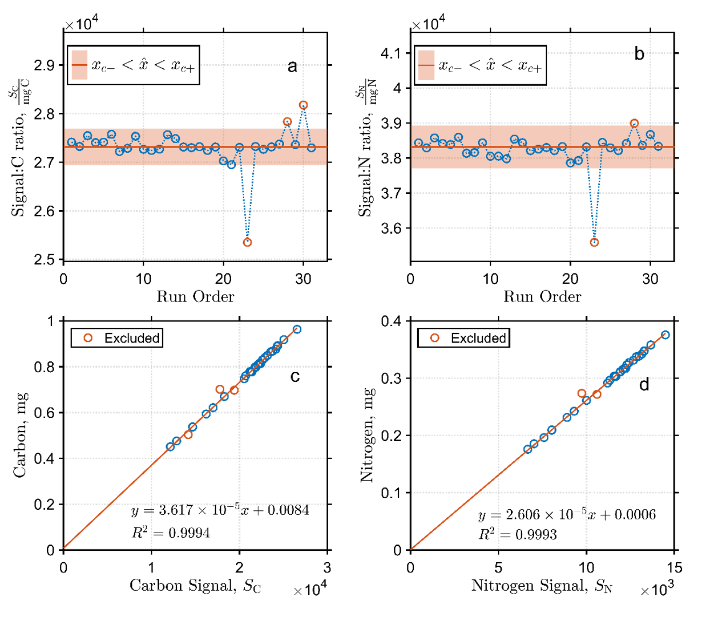

Figure 13. (a, b) Ratios of instrumental carbon and nitrogen signals $S_C$, $S_N$ to weights (mg) for each element from sulfanilamide (C6H8N2O2S) calibration standards during an analytical run for POC filter samples. Shaded range is the acceptance criteria range for calibration runs defined by the modified z-score method (7, 8), for all sulfanilamide runs. Values outside that range are considered outliers and excluded from calibration. (c, d) Calibration regression curve (linear least-squares fit) of element weight vs. S using data in (a, b). Red symbols (excluded) depict the values that failed quality criterion above and were excluded from regression.

### 6.3.2 Blank Correction Computations

For calibration analysis measurements—independent of the approach—using either the instrument software or an external calibration curve, each run (i.e., elemental analysis measurement) of the primary calibration standard must be blank corrected for the specific type of encapsulating packaging used, such that

$$S^{std}_{C_i} = S^{std\*}_{C_i} - \hat{S}^{Pk_a}_C$$	(8)

Where $S^{std}_{C_i}$ is the packaging-corrected C (or N) signal for the $i^{th}$ standard calibration run, $S^{std*}_{C_i}$ is the corresponding uncorrected (superscript $*$) signal, and $\hat{S}^{Pk_a}_C$ is the estimate of the blank signal for packaging (superscript Pk) type a. The estimate of $\hat{S}^{Pk_a}_C$ can be derived in multiple ways and does not necessarily need to be the arithmetic mean of all blank runs for a specific type of sample packaging. Users can opt to derive a blank signal estimate as the median or a run average that accounts for instrumental drift (see Section 6.2.4), depending on how the blank signal data is distributed during a sample sequence. The correction in (8) should be applied to all runs corresponding to each $a_1$...$a_n$ packaging type.

The correction of filter samples requires additional considerations beyond packaging effects. Sample measurements include a signal for analytical filter and filtrate blanks, for which the samples need to be corrected. Two general approaches for filtrate blank correction are examined in Section 4, and recommendations for developing an analytical filter blank correction are discussed in Section 6.2.2.

Following from (2), the total apparent mass of C measured (i.e., uncorrected for any blank signal) on a filter sample can be described by

$$M^{C\*}_T = M^C_{POC} + M^C_{ads} + M^C_f + M^C_{Pk_f}$$	(9)

where the additional terms $M^C_f$ and $M^C_{Pk_f}$ are the apparent C mass from the analytical filter (subscript $‘f’$) and the sample filter packaging (subscript $‘Pk_f’$ ) blanks, respectively. If the filtrate blank was measured directly on blank filters (see Section 4.2), it follows from (9) that the measurement on the filters carries the packaging and analytical blank signals, such that

$$M^{C\*}_{ads} = M^C_{ads} + M^C_f + M^C_{Pk_f}$$	(10)

and equivalently for the analytical filter blank

$$M^{C\*}_f = M^C_f + M^C_{Pk_f}$$	(11) 

where $M^{C\*}_{ads}$ and $M^{C\*}_{f}$ are the uncorrected apparent C mass measured on the filtrate and analytical filter blanks, respectively. 

The filtrate blank filter in (10) also carries the putative signal of the analytical blank filter because the only difference between them is that the former was exposed to the filtrate. If the analytical blank is generated in the field and put through the entire sample processing path as recommended in Section 6.2.3, that signal is also carried in the filtrate blank. From here it follows that (10) can be re-written as

$$M^{C\*}_T = M^C_{POC} + M^{C\*}_{ads}$$	(12)

so that $M^C_{POC}$ becomes

$$M^C_{POC} = M^{C\*}_T - M^{C*}_{ads}$$	(13)

If the filtrate blank correction is evaluated using a regression approach (see Section 4.1), the analytical filter blank signal should be explicitly incorporated in the calculation of $M^C_{POC}$. The measured values of $M^C_T$ on sample filters that go into setting up the regressions should be corrected for $M^C_f$ and $M^C_{Pk_f}$, which as (9, 12) imply, is given by

$$M^C_T = M^{C\*}_T - M^{C\*}_f$$	(14)

Then, $M^C_{POC}$ is normalized by the volume filtered V to obtain the concentration of POC

$$C^C_{POC} = \frac{M^C_{POC}}{V}$$	(15)

## 6.4 Uncertainty and Performance Metrics

Biogeochemical field measurements must be generated with a documented uncertainty so that their quality is known and their contribution to the uncertainty of derived products, such as mass balance budgets, modeling exercises, and the calibration and validation of satellite sensors, can be estimated. Practitioners often report the uncertainty of POC, PN, and other biogeochemical quantities as the analytical precision of the instrument ultimately used for its measurement while obviating most of the other sources that contribute to the overall uncertainty of a particular measurement. The estimation of most physical quantities involves multiple measurement steps, with each one carrying an associated uncertainty. Those uncertainties must be propagated through the calculations involved in deriving the final best estimate of a measured quantity. The result of that propagation is the combined standard uncertainty, and it represents the 68% confidence interval around the best estimate.

A simplified example of such a calculation for a POC and PN preliminary dataset (GO-SHIP P06 Leg 2 2017) is provided here; it may serve as a template for similar datasets, following standard uncertainty propagation theory such as that presented in Taylor (1997). This exercise is not meant to provide the uncertainty budget for POC and PN measurements in general but to serve as an example of how researchers and data contributors may approach this problem with their own measurements. Choice of protocol, sampling instrumentation, blank correction, replication, and how the variables in question are correlated affect overall uncertainty and the suitable approach to estimate it. An in-depth discussion of uncertainty estimation is beyond the scope of this volume. Readers are encouraged to consult additional sources when implementing their own uncertainty estimation strategies (e.g., JCGM, 2008; Ellison and Williams, 2012). A thorough discussion of uncertainties in the context of oceanographic trace element analyses by Worsfold et al. (2019) can provide further guidance.

### 6.4.1 Uncertainty Budget

For a quantity derived from addition or subtraction of independent variables $a$ and $b$, $y=a+b$ or $y=a-b$, the combined uncertainty in $y$, $u_y$, is given by

$$u_y = \sqrt{{u_a}^2 + {u_b}^2}$$	(16)

which is the sum in quadrature of the uncertainties $u_a$ and $u_b$ for the quantities $a$ and $b$ used to calculate $y$. For quantities, $q$, derived from a product or quotients of measured magnitudes $a,…,f$

$$q = \frac{a x ... x c}{d x ... x f}$$	(17)

the fractional or relative uncertainty of $q$, provided that the uncertainties in $a,…,f$ are independent and random, is given by the sum in quadrature of their respective fractional uncertainties

$$\frac{u_q}{|q|} = \sqrt{(\frac{u_a}{a})^2 + ... + (\frac{u_c}{c})^2 + .... + (\frac{u_d}{d})^2 + ... + (\frac{u_f}{f})^2}$$	(18)

Given that in (9), the mass of C as POC, $M^C_{POC}$, is derived from the total uncorrected mass of C, $M^{C\*}_T$, measured on sample filters, by subtracting the blank signals described in 6.3.2. from (16) it follows that the propagated uncertainty for $M^C_{POC}$ is given by

$$u_{M_{POC}^C} = \sqrt{u^2_{M^C_{Pk_f}} + u^2_{M^C_{f}} + u^2_{M^C_{ads}} + u^2_{M^{C\*}_{T}}}$$	(17)

The concentration of POC (or PN) is a quotient (15), and thus its relative uncertainty would be given by

$$\frac{u_{POC}}{C_^C_{POC}} = \sqrt{(\frac{u_{M^C_T}}{M^C_T})^2 + (\frac{u_V}{V})^2}$$	(18)

The standard deviation from repeated observations during each analytical run can provide a first approximation of the uncertainties of analytical blanks and sample replicates (17). The uncertainty of the filtration volume V can be estimated from the measurement precision of the instrument used, such as a measuring cylinder. If multiple volume measurements are added up for a given sample replicate, the primary uncertainty must be multiplied by the number of measurements carried out. A constant filtration volume uncertainty of 5 mL was applied to all observations for the example presented here.

Fractional uncertainties for all POC and PN values in a preliminary version of the GO-SHIP P06 Leg 2 2017 dataset had medians of 12.1–12.3% and varied between 1.7–142% and 1.1–213%, respectively (Figure 14). The uncertainties for both elements appear to be bi-modal, and thus the medians might not be the best representation of their distributions. For most of the observations in the dataset, the uncertainty of the total mass of C or N (superscript X) in sample filters, ${M_T}^{X*}$, were the largest contributors to overall uncertainty (Figure 15). The filtrate and sample encapsulation blanks were the next most important and, on average, explained 16–17% and 2–3% of the uncertainty budgets, respectively. Filtration volume accounted for 3% and 2% of the uncertainty in POC and PN. However, as POM concentrations increased closer to the Peru-Chile upwelling region (right-hand side of plots) and the uncertainty in ${M_T}^{X*}$ decreased, filtration volume became the most important component of the overall uncertainty for some observations (Figure 15b, d). The measurements used in this exercise were collected mainly in the hyper-oligotrophic waters of the South Pacific Gyre and represent the lower end of method sensitivity. In contrast, those at the eastern end of the transects are more typical of coastal and hypertrophic conditions. This observation highlights the need to determine filtration volume during sample processing with the same care and attention toward achieving accuracy as with any other variable during subsequent analytical steps in the laboratory.

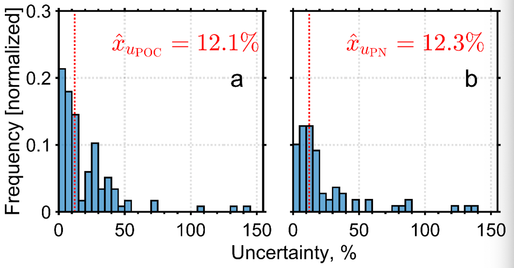

Figure 14. Histograms of fractional uncertainty as percentages for (a) POC and (b) PN for samples collected during the GO-SHIP P06 Leg 2 2017 campaign. Vertical red lines depict the median fractional uncertainties in each case.

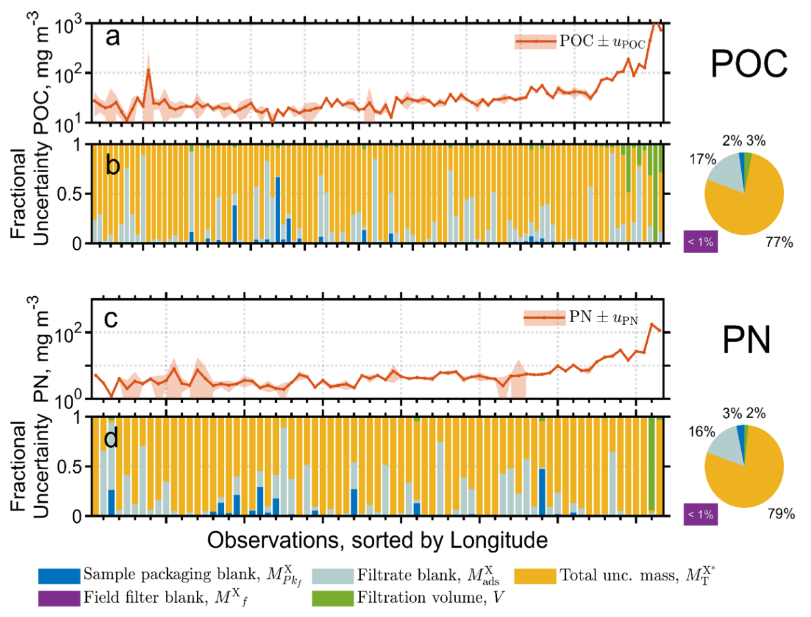

Figure 15. (a, c) Concentration of POC, PN during the GO-SHIP P06 Leg 2 2017 sorted in ascending order by station longitude along sampling transect in the South Pacific Ocean across the Gyre to the Peru-Chile upwelling region. Shaded regions depict the best estimate of concentration ± the propagated uncertainty. (b, d) Bar plots depict the contribution to measurement uncertainty (i.e., uncertainty budget) for each of the values in panels a and c by the variables in equations 17, 18. The respective mean uncertainty budgets for POC and PN are depicted in the pie charts to the right on panels b and d.

### 6.4.2 Detection Limits

There is a lack of agreement in how to express and calculate the various performance and quality assurance metrics used to characterize analytical methods. Limit of blank (LOB), limit of detection (LOD), and limit of quantitation (LOQ) are all parameters used to determine the smallest amount of analyte that can be reliably measured by an analytical procedure (Armbruster and Pry, 2008). Following these authors, LOB is the highest apparent analyte concentration expected when blank replicates containing no analyte are analyzed. In the case of POM, one of the blanks—the filtrate blank—contains the measured analytes, which makes the determination of these parameters more difficult. LOB is given by

$$B_L = \overline{x}_B \pm 1.645\sigma_B$$	(19)

where $\overline{x}_B$ and $\sigma_B$ are the mean and standard deviations in element mass or instrumental signal units of the blank replicates, and 1.645 is the critical z value for $\alpha$ = 0.05 (i.e., LOB is the 95th percentile of observed blanks). The assumption is that the remaining 5% of the blank distribution could potentially be in the range of very low concentration samples. In the case of analysis of filters for POC and PN, the LOB should include the aggregate blank signals in (9). The distribution of the C and N blanks, and the uncorrected sample measurements, for the GO-SHIP P06 Leg 2 2017 dataset are presented in Figure 16. Applying (20) to those data, the resulting LOB for C and N in POM are 22 and 4.6 µg, respectively. 

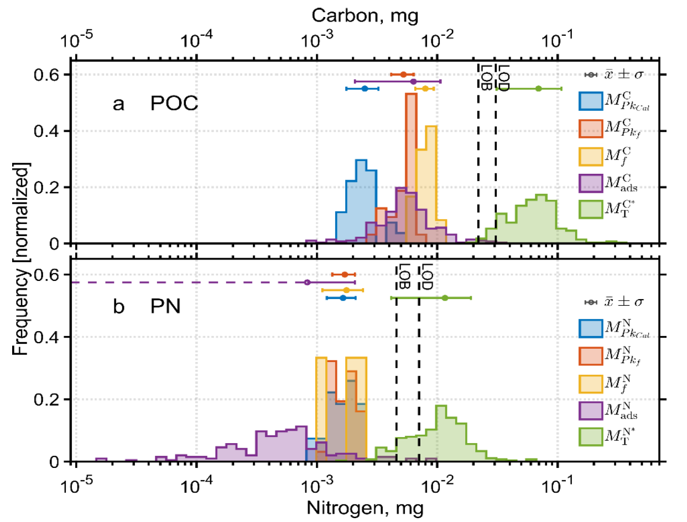

Figure 16. Histograms of the apparent (a) C and (b) N mass, $M^C$ and $M^N$, for the measured blank signals, and uncorrected sample filters for samples collected during the GO-SHIP P06 Leg 2 2017 campaign. $M_{ads}$ is the filtrate blank, corrected for the average field filter blank, $M_f$. $M_{Pk_{Cal}}$ and $M_{Pk_f}$ are the encapsulating material blanks for calibration standards and sample filters, respectively (see Section 5.4). $M_T$ is the total mass of either element on sample filters, uncorrected for above blanks. The ranges plotted above each histogram depict the mean $\pm$ one standard deviation for each variable. The hashed line for ${M^N}_{ads}$ signifies that the lower bound is negative. LOB and LOD are the limits of blank and limits of detection, respectively.

LOD is the lowest amount of analyte that can be distinguished from the LOB and where detection is practical. A common approach to estimating LOD is to make several blank replicate measurements and define LOD as the mean of those measurements plus a number of standard deviations. That number varies among analysts and applications, with some analysts using 2, 4, or 10 $\sigma$. An alternative method is to measure samples with “small but known” concentrations of the analyte and thus effectively compare the response of a low concentration sample vs. that of the blank. Based on the protocols of Clinical and Laboratory Standards Institute (2004), Armbruster and Pry (2008) propose the LOD as 

$$D_L = B_L + 1.645\sigma_{C -> 0}$$	(20)

where $\sigma_{C -> 0}$ is the standard deviation of a small but known concentration sample. As discussed in Section 6.7, no reference material that mimics the biological and mineral matrix of marine POM exists that would allow the preparation of such a sample in the strictest sense. Ideally, test samples should also be measured on the same type of filter used for field sample collection, such that all the effects of sample processing are evaluated when determining the LOD. Preparation of solutions of known concentration is a routine analytical practice for analytes in a solution matrix. In the case of particulate samples and other solids, analysis of known quantities of primary reagents or reference materials is used as validation. However, given that the filtrate blank typically contains a measurable amount of the target analytes, considerable overlap would be expected between test samples prepared using known amounts of bulk reference materials or reagents and, for example, the sum of all the blank signals in Figure 16. To provide a practical solution to POM analysts until a suitable reference material is available that allows the use of the approach in (21), a preliminary (superscript ') LOD is estimated here as 

$${D'}_L = B_L 0 + 2\sigma_{B}$$	(21)

where $\sigma_{B}$ is the standard deviation of the sum of the blank signals in (9), which are the filtrate, the dry filter, and the sample encapsulation blanks[^4]. Using that approach, the preliminary LOD for POC and PN in the test dataset in Figure 16 are 31 and 7 $\mu$g, respectively.

The LOQ is the lowest concentration of analyte that can be quantitatively detected with a stated accuracy and precision. In clinical diagnosis literature (e.g., Hay et al., 1991), it is defined as the concentration that results in a CV of 20% or other set value, and is a measure of the precision at low analyte concentration. The LOQ ≥ LOD, but if the observed accuracy and precision at the LOD meet the requirements set, then: LOQ = LOD. If the threshold is not met at the LOD, a higher analyte concentration must be tested to determine the LOQ (Armbruster and Pry, 2008). One approach outlined by Shrivastava et al. (2011) is to analyze 10 times a test sample of a mass of 5 x LOD and calculate LOQ as 10 times the standard deviation, $\sigma$, of those runs

$$Q_L = 10\sigma$$	(22)

[^4]: As stated elsewhere (6.3.2 and A.1.6), if the filtrate blank is evaluated on individual filters as outlined in Section 4.2, if no other correction is applied to them, those three blank signals are embodied in those individual filtrate blank runs. Exercise care to avoid double-count blank signals when computing concentrations, uncertainties, and performance metrics.

## 6.5 Balance Precision and Weighing Protocol

The accuracy of carbon elemental analysis is contingent on the weighing precision and accuracy of the calibration standards. If balance precision does not appropriately match that of the elemental analyzer or optimal weighing protocols are lacking, the quality of analytical results will be concomitantly degraded. Weighing should be performed on a balance with precision in the range of 0.001–0.0001 mg (i.e., ultra-micro balance), correctly set up on a vibration-dampening weighing table made of marble, granite, or other heavy material. 

The weighing station should ideally be in an enclosed, dedicated laboratory space free of wind drafts, excessive airborne particles, and floor vibrations. The balance should be fitted with an anti-static kit to neutralize electrostatic charges that can harm weighing accuracy. Balance calibration should be certified at least annually by a qualified technician, against weight standards traceable to a national metrology institute, such as NIST or any member of the European Association of National Metrology Institutes (EURAMET). A set of traceable weights should also be kept in the laboratory to monitor instrumental drift at the beginning and end of each weighing session.

The importance of user experience with high precision weighing for analytical calibration should not be underestimated. Given the small amount of material necessary for calibration standards, relatively minor weighing errors can have an outsized effect on analytical quality. Balance operators should have sufficient experience and a record of precise results weighing calibration standards for analytical applications.

## 6.6 Reporting

Funding agencies have created data management structures to ensure data permanence and availability from research awards. The United States Division of Ocean Sciences at the National Science Foundation (NSF) created the Biological and Chemical Oceanography Data Management Office (BCO-DMO; Chandler et al., 2012). NASA established the SeaWiFS Bio-optical Archive and Storage System (SeaBASS; Werdell and Bailey 2002), which require datasets be submitted for permanent storage and distribution. The European Union is developing the European Marine Observation and Data Network (EMODnet; Martín-Miguéz et al., 2019). Data must be supported by appropriate meta-data to improve discovery and usability, including complete geolocation and timestamp information, as well as sampling and analysis protocols. Research data repositories have increasingly moved to require performance metrics for accuracy and precision to facilitate data assimilation into models and error propagation calculations. Data submitters should follow the latest guidelines and recommendations from their corresponding data repositories. Here we present a set of suggested guidelines for POC data submission and in situ biogeochemical parameters in general.

### 6.7.1 Metadata

Data submitters should meet the metadata guidelines of their corresponding data repositories and include any other relevant data. Some individual large-scale projects might enforce additional metadata requirements. Basic geolocation coordinates, sampling depth, and times of sample collection in GMT format are essential parameters for data to be usable in satellite calibration and validation activities. For example, submitters to the NASA SeaBASS repository must provide a metadata header for each data file submitted to its database:

`/begin_header`  
`/identifier_product_doi=10.5067/SeaBASS/SOCCOM/DATA001`  
`/received=20190701`  
`/investigators=Emmanuel_Boss,Lynne_Talley`  
`/affiliations=University_of_Maine,Scripps_Institution_of_Oceanography`  
`!/affiliations=UMaine,Scripps`  
`/contact=emmanuel.boss@maine.edu`  
`/experiment=SOCCOM`  
`/cruise=ACE_2017`  
`!/cruise=ACE`  
`/station=NA`  
`/data_file_name=SOCCOM_ACE_POC.sb`  
`/documents=SOCCOM_ACE_POC_doc.pdf`  
`/calibration_files=SOCCOM_ACE_POC_doc.pdf`  
`/data_type=bottle`  
`/data_status=preliminary`  
`/start_date=20161228`  
`/end_date=20170314`  
`/start_time=06:55:00[GMT]`  
`/end_time=07:18:00[GMT]`  
`/north_latitude=-43.9953[DEG]`  
`/south_latitude=-71.6929[DEG]`  
`/east_longitude=70.000[DEG]`  
`/west_longitude=57.502[DEG]`  
`/water_depth=NA`  
`!`  
`! COMMENTS`  
`! Reference_file = Project12_CTD_POCconc.xlsx`  
`! CCHDO_EXPO = RUB320161220`  
`! Quality codes (following CCHDO guidelines except flag 0):`  
`!     0. No quality check performed on measurement.`  
`!     1. Sample for this measurement was drawn from water bottle but analysis not received.`  
`!     2. Acceptable measurement.`  
`!     3. Questionable measurement.`  
`!     4. Bad measurement.`   
`!     5. Not reported.`  
`!     6. Mean of replicate measurements (Number of replicates is specified in column bincount).`  
`!     9. Sample not drawn for this measurement from this bottle.`  
`!`  
`! The POC and PON samples are acidified to get rid of inorganic carbon and nitrogen.`  
`! A DOC/DON adsorption blank to account for contamination and dissolved organic carbon (DOC)`  
`! and nitrogen (DON), was taken during sampling by stacking two filters in the filtration funnels`  
`! and filtering the sample as normal. The upper filter will be the total (dissolved and particulate)`  
`! organic carbon and nitrogen sample and the bottom filter will be the DOC/DON adsorption blank.`  
`! The organic carbon and nitrogen from the DOC/DON adsorption blank was removed from the concentration of the total filters to retrieve POC and PON.`  
`!`  
`! Detection Limit:`  
`!     [C] = 100 micrograms`  
`!`  
`/missing=-9999`  
`/delimiter=comma`  
`/fields=sample,station,bottle,depth,year,month,day,sdy,time,lon,lat,POC,volfilt,quality`  
`/units=none,none,none,m,yyyy,mo,dd,ddd,hh:mm:ss,degrees,degrees,mg/m^3,l,none`  
`/end_header`  

Any blank correction applied to the data should be reported, particularly those that relate to filtrate blank (see Section 4), as well as any validation performed during analyses against a standard reference material or calibration reagent.

## 6.7 Consensus Reference Material

Development of climate-quality data records requires measurement accuracy to be of the highest quality possible, an objective that can only be verified through validation against reference materials (RM). No RM specific for POC, such as the one available for DOC (Hansell, 2005), exists yet. During elemental analysis for POC, many authors use NIST Buffalo River Sediment SRM 8704 (NIST, 2013), which has a certified C mass fraction of 3.351± 0.017% for analytical determinations, with a minimum sample weight of 250 mg, as a proxy RM for marine-derived organic matter. The mineral content of NIST 8704 is likely much higher and of a different nature than that of a typical POC sample, thus its use in this context is debatable. Some commercial vendors offer “NIST traceable” reference materials derived from microalgae, such as *Spirulina* sp. (SKU B2162; Elemental Microanalysis, Pennsauken, NJ). The issue of sample matrix composition and its effect on analytical measurements was highlighted in an assessment of chemical RMs in ocean science:
> “‘[C]ompositional’ or matrix reference materials […] are based on ‘natural’ substances (e.g., seawater, sediments, or biological materials such as phytoplankton), and offer an advantage over primary standards by providing a better match to sample composition. Thus, they offer a tool to minimize matrix effects and to identify problems in the application of analytical methods to natural samples” (National Research Council, 2002).

Fast and slow sinking marine particles contain variable amounts of biogenic silica, carbonates (CaCO3), and terrigenous clays; their proportions increase with depth relative to organic matter (Lam and Marchal, 2015). Carbonates (i.e., PIC) pose the primary matrix composition-related interference in the analysis of POC, so a suitable reference material for this measurement should ideally contain a known proportion of inorganic C within the typical ranges of suspended aquatic POM. As discussed in Section 5.3, the removal of PIC is a critical step in processing POC samples prior to elemental analysis. Such an RM would allow assessing the accuracy of the quantitative removal of all inorganic C from the samples during the acidification step.

The National Research Council review issued a set of recommendations for RMs for particle analyses, including the development of “biological matrices” derived from cultures of a species of diatom (*Thalassiosira pseudonana*), dinoflagellate (*Scrippsiella tochoidea*), and coccolithophore (*Emiliana huxleyi*) (National Research Council, 2002). The rationale was that these phytoplankton species encompass three major matrices: opal, carbonate, and organic matter. Collectively, these typify a wide range of marine particles of predominantly biological origin.

# 7. References

Altabet, M A, Bishop, J.K.B., & McCarthy, J.J. (1992). Differences in particulate nitrogen concentration and isotopic composition for samples collected by bottles and large-volume pumps in Gulf Stream warm-core rings and the Sargasso Sea. Deep Sea Research Part A. Oceanographic Research Papers, 39, S405–S417. https://doi.org/http://dx.doi.org/10.1016/S0198-0149(11)80022-1  
Altabet, Mark A. (1990). Organic C, N, and stable isotopic composition of particulate matter collected on glass--fiber and aluminum oxide filters. Limnology and Oceanography, 35(4), 902–909. https://doi.org/10.4319/lo.1990.35.4.0902  
Analytical Methods Committee. (2006). Evaluation of analytical instrumentation. Part XIX CHNS elemental analysers. Accreditation and Quality Assurance, 11(11), 569–576. https://doi.org/10.1007/s00769-006-0185-x  
Arrigo, K.R., Robinson, D.H., Worthen, D.L., Dunbar, R. B., DiTullio, G.R., VanWoert, M., & Lizotte, M.P. (1999). Phytoplankton community structure and the drawdown of nutrients and CO2 in the Southern Ocean. Science, 283(5400), 365–367. https://doi.org/10.1126/science.283.5400.365  
Bao, R., McNichol, A.P., Hemingway, J.D., Lardie Gaylord, M.C., & Eglinton, T.I. (2019). Influence of Different Acid Treatments on the Radiocarbon Content Spectrum of Sedimentary Organic Matter Determined by RPO/Accelerator Mass Spectrometry. Radiocarbon. https://doi.org/10.1017/rdc.2018.125  
Bare, S.R., Lilly, M., Chermak, J., Eggert, R., Halperin, W., Hannahs, S., Hayes, S., Hendrich, M., Hurd, A., Osofsky, M., & Tway, C. (2016). The U.S. Research Community’s Liquid Helium Crisis. https://doi.org/10.7936/K7571B6D  
Bauer, J.E., Druffel, E.R.M., Wolgast, D.M., & Griffin, S. (2002). Temporal and regional variability in sources and cycling of DOC and POC in the northwest Atlantic continental shelf and slope. Deep Sea Research Part II: Topical Studies in Oceanography, 49(20), 4387–4419. https://doi.org/https://doi.org/10.1016/S0967-0645(02)00123-6  
Benner, R. (2002). Chemical composition and reactivity. In D. Hansell & C. Carlson (Eds.), Biogeochemistry of Marine Dissolved Organic Matter (pp. 59–85). Academic Press.  
Bidigare, R.R., Heukelem, L. Van, Trees, C.C., & Perl, J. (2004). HPLC Phytoplankton Pigments: Sampling, Laboratory Methods, and Quality Assurance Procedures. In J. L. Mueller, G.S. Fargion, & C.R. McClain (Eds.), Ocean Optics Protocols For Satellite Ocean Color Sensor Validation: Vol. Revision 5. National Aeronautics and Space Administration.  
Bishop, J. K.B., & Edmond, J. M. (1976). A new large volume filtration system for the sampling of oceanic particulate matter. Journal of Marine Research, 34, 181–198.  
Bishop, J. K.B. (2011). Getting Good Weight. Marine Particles: Analysis and Characterization, 229–234. https://doi.org/10.1029/gm063p0229  
Bishop, J.K.B., Lam, P.J., & Wood, T.J. (2012). Getting good particles: Accurate sampling of particles by large volume in-situ filtration. Limnology and Oceanography: Methods, 10(9), 681–710. https://doi.org/10.4319/lom.2012.10.681  
Bishop, J.K.B., Schupack, D., Sherrell, R.M., & Conte, M. (1985). A Multiple-Unit Large-Volume In Situ Filtration System for Sampling Oceanic Particulate Matter in Mesoscale Environments. In Mapping Strategies in Chemical Oceanography (Vol. 209, pp. 155–175). American Chemical Society. https://doi.org/doi:10.1021/ba-1985-0209.ch009  
Bopp, L., Monfray, P., Aumont, O., Dufresne, J.-L., Le Treut, H., Madec, G., Terray, L., & Orr, J. C. (2001). Potential impact of climate change on marine export production. Global Biogeochemical Cycles, 15(1), 81–99. https://doi.org/10.1029/1999GB001256  
Boss, E., Haëntjens, N., Ackleson, S., Balch, B., Chase, A., Dall’Olmo, G., Freeman, S., Liu, Y., Loftin, J., Neary, W., Nelson, N., Novak, M., Slade, W., Proctor, C., Tortell, P., & Westberry, T. (2019). Inherent Optical Property Measurements and Protocols: Best practices for the collection and processing of ship-based underway flow-through optical data. In A. R. Neeley & A. Mannino (Eds.), IOCCG Ocean Optics and Biogeochemistry Protocols for Satellite Ocean Colour Sensor Validation (pp. 1–23). IOCCG. https://doi.org/http://dx.doi.org/10.25607/OBP-664  
Boss, Emmanuel, Slade, W. H., Behrenfeld, M., & Dall’Olmo, G. (2009). Acceptance angle effects on the beam attenuation in the ocean. Optics Express, 17(3), 1535–1550. https://doi.org/10.1364/OE.17.001535  
Brodie, C. R., Leng, M. J., Casford, J. S. L., Kendrick, C. P., Lloyd, J. M., Yongqiang, Z., & Bird, M. I. (2011). Evidence for bias in C and N concentrations and δ13C composition of terrestrial and aquatic organic materials due to pre-analysis acid preparation methods. Chemical Geology. https://doi.org/10.1016/j.chemgeo.2011.01.007  
Buesseler, K., Ball, L., Andrews, J., Benitez-Nelson, C., Belastock, R., Chai, F., & Chao, Y. (1998). Upper ocean export of particulate organic carbon in the Arabian Sea derived from thorium-234. Deep Sea Research Part II: Topical Studies in Oceanography, 45(10), 2461–2487. https://doi.org/https://doi.org/10.1016/S0967-0645(98)80022-2  
Byers, K. B. (1998). Risks Associated with Liquid Nitrogen Cryogenic Storage Systems. Journal of the American Biological Safety Association, 3(4), 143–146. https://doi.org/10.1177/109135059800300406  
Carabel, S., Godínez-Domínguez, E., Verísimo, P., Fernández, L., & Freire, J. (2006). An assessment of sample processing methods for stable isotope analyses of marine food webs. Journal of Experimental Marine Biology and Ecology, 336(2), 254–261. https://doi.org/10.1016/j.jembe.2006.06.001  
Cetinić, I., Perry, M. J., Briggs, N. T., Kallin, E., D’Asaro, E. A., & Lee, C. M. (2012). Particulate organic carbon and inherent optical properties during 2008 North Atlantic bloom experiment. Journal of Geophysical Research: Oceans, 117(6). https://doi.org/10.1029/2011JC007771  
Cetinić, I., Poulton, N., & Slade, W. H. (2016). Characterizing the phytoplankton soup: pump and plumbing effects on the particle assemblage in underway optical seawater systems. Optics Express, 24(18), 20703. https://doi.org/10.1364/oe.24.020703  
Chandler, C., Groman, R., Allison, M., Wiebe, P., Glover, D., & Gegg, S. (2012). Effective management of ocean biogeochemistry and ecological data: The BCO-DMO story. EGU General Assembly Conference Abstracts, 14, 1258. http://adsabs.harvard.edu/abs/2012EGUGA..14.1258C  
Collos, Y., Jauzein, C., & Hatey, E. (2014). Particulate carbon and nitrogen determinations in tracer studies: The neglected variables. Appl Radiat Isot, 94, 14–22. https://doi.org/10.1016/j.apradiso.2014.06.015  
Cutter, G., Casciotti, K., Croot, P., Geibert, W., Heimbürger, L.-E., Lohan, M., Planquette, H., & van de Flierdt, T. (2017). Sampling and Sample-handling Protocols for GEOTRACES Cruises. http://www.geotraces.org/images/Cookbook.pdf  
Dortch, Q., Clayton, J. R., Thoresen, S. S., & Ahmed, S. I. (1984). Species differences in accumulation of nitrogen pools in phytoplankton. Marine Biology, 81(3), 237–250. https://doi.org/10.1007/BF00393218  
Ellison, S. L. R., & Williams, A. (2012). EURACHEM/CITAC Guide CG 4: Quantifying uncertainty in analytical measurement (S. L. R. Ellison & A. Williams (eds.); Third edit). https://doi.org/0 948926 15 5  
Fadeeva, V. P., Tikhova, V. D., & Nikulicheva, O. N. (2008). Elemental analysis of organic compounds with the use of automated CHNS analyzers. Journal of Analytical Chemistry, 63(11), 1094–1106. https://doi.org/10.1134/s1061934808110142  
Fuhrman, J., & Bell, T. (1985). Biological considerations in the measurement of dissolved free amino acids in seawater and implications for chemical and microbiological studies. Marine Ecology Progress Series. https://doi.org/10.3354/meps025013  
Galloway, A. W. E., & Winder, M. (2015). Partitioning the relative importance of phylogeny and environmental conditions on phytoplankton fatty acids. PLoS ONE, 10(6), 1–23. https://doi.org/10.1371/journal.pone.0130053  
Gardner, W. D., Mishonov, A. V., & Richardson, M. J. (2006). Global POC concentrations from in-situ and satellite data. Deep-Sea Research Part II: Topical Studies in Oceanography, 53(5–7), 718–740. https://doi.org/10.1016/j.dsr2.2006.01.029  
Gardner, Wilford D., Richardson, M. J., Carlson, C. A., Hansell, D., & Mishonov, A. V. (2003). Determining true particulate organic carbon: Bottles, pumps and methodologies. Deep Sea Research Part II: Topical Studies in Oceanography, 50(3–4), 655–674. https://doi.org/10.1016/S0967-0645(02)00589-1  
Gardner, Wilford D., Walsh, I. D., & Richardson, M. J. (1993). Biophysical forcing of particle production and distribution during a spring bloom in the North Atlantic. Deep-Sea Research Part II, 40(1–2), 171–195. https://doi.org/10.1016/0967-0645(93)90012-C  
Gardner, Wilford D. (1977). Incomplete extraction of rapidly settling particles from water samplers. Limnology and Oceanography, 22(4), 764–768. https://doi.org/10.4319/lo.1977.22.4.0764  
Gardner, W.D., Biscaye, P. E., Zaneveld, J. R.V, & Richardson, M. J. (1985). Calibration and comparison of the LDGO nephelometer and the OSU transmissometer on the Nova Scotian rise. Marine Geology, 66(1), 323–344. https://doi.org/https://doi.org/10.1016/0025-3227(85)90037-4  
GEOTRACES. (2010). GEOTRACES: An International study of the marine biogeochemical cycles of trace elements and their isotopes. http://www.geotraces.org/  
Goñi, M.A., Corvi, E. R., Welch, K. A., Buktenica, M., Lebon, K., Alleau, Y., & Juranek, L.W. (2019). Particulate organic matter distributions in surface waters of the Pacific Arctic shelf during the late summer and fall season. Marine Chemistry. https://doi.org/10.1016/J.MARCHEM.2019.03.010  
Hansell, D.A. (2005). Dissolved organic carbon reference material program. Eos Trans. AGU, 86(35), 318. https://doi.org/10.1029/2005EO350003  
Hansell, D.H., Carlson, C.A., Repeta, D.J., & Schlitzer, R. (2009). Dissolved organic matter in the ocean: New insights stimulated by a controversy. Oceanography, 22, 52–61.  
Hedges, J.I., & Stern, J.H. (1984). Carbon and nitrogen determinations of carbonate‐containing solids. In Limnology and Oceanography. https://doi.org/10.4319/lo.1984.29.3.0657  
Hernes, P.J., Dyda, R.Y., & Bergamaschi, B.A. (2020). Reassessing Particulate Organic Carbon Dynamics in the Highly Disturbed San Francisco Bay Estuary. Frontiers in Earth Science, 8(June), 1–13. https://doi.org/10.3389/feart.2020.00185  
Hernes, P.J., Peterson, M.L., Murray, J.W., Wakeham, S.G., Lee, C., & Hedges, J.I. (2001). Particulate carbon and nitrogen fluxes and compositions in the central equatorial Pacific. Deep-Sea Research Part I: Oceanographic Research Papers, 48(9), 1999–2023. https://doi.org/10.1016/S0967-0637(00)00115-1  
Holser, R R., Goni, M.A., & Hales, B. (2011). Design and application of a semi-automated filtration system to study the distribution of particulate organic carbon in the water column of a coastal upwelling system. Marine Chemistry, 123(1–4), 67–77. https://doi.org/10.1016/j.marchem.2010.10.001  
Hooker, S. B., McClain, C., & Mannino, A. (2007). NASA Strategic Planning Document: A Comprehensive Plan for the Long-Term Calibration and Validation of Oceanic Biogochemical Satellite Data (Issue July 2007). http://oceancolor.gsfc.nasa.gov/DOCS/CalValPlan_SP_214152.pdf  
Horowitz, A.J., Smith, J. J., & Elrick, K.A. (2001). Selected laboratory evaluations of the whole-water sample-splitting capabilities of a prototype fourteen-liter teflon churn splitter. 14. http://fisp.wes.army.mil/Horowitz report_ofr01-386.pdf  
Hurd, D.C., & Spencer, D.W. (1991). Introduction and Rationale for the Workshop. In D.C. Hurd & D.W. Spencer (Eds.), Marine Particles: Analysis and Characterization (pp. 1–4). American Geophysical Union. https://doi.org/10.1029/GM063p0001  
Iglewicz, B., & Hoaglin, D.C. (1993). How to Detect and Handle Outliers (E. F. Mykytka (ed.)). ASQC Quality Press.  
JCGM. (2008). Evaluation of measurement data — Guide to the expression of uncertainty in measurement. International Organization for Standardization Geneva ISBN, 50(September), 134. https://doi.org/10.1373/clinchem.2003.030528  
Jónasdóttir, S. H. (2019). Fatty acid profiles and production in marine phytoplankton. Marine Drugs, 17(3). https://doi.org/10.3390/md17030151  
King, P., Kennedy, H., Newton, P.P., Jickells, T.D., Brand, T., Calvert, S., Cauwet, G., Etcheber, H., Head, B., Khripounoff, A., Manighetti, B., & Carlos Miquel, J. (1998). Analysis of total and organic carbon and total nitrogen in settling oceanic particles and a marine sediment: an interlaboratory comparison. Marine Chemistry, 60(3–4), 203–216. https://doi.org/10.1016/S0304-4203(97)00106-0  
Knap, A., Michaels, A., & Close, A. (1994). JGOFS Protocols. JGOFS Planning Office: Woods Hole, MA.   
Komada, T., Anderson, M.R., & Dorfmeier, C.L. (2008).  Carbonate removal from coastal sediments for the determination of organic carbon and its isotopic signatures, δ 13 C and Δ 14 C: comparison of fumigation and direct acidification by hydrochloric acid. Limnology and Oceanography: Methods. https://doi.org/10.4319/lom.2008.6.254  
Lam, P.J., Lee, J.-M., Heller, M.I., Mehic, S., Xiang, Y., & Bates, N.R. (2018). Size-fractionated distributions of suspended particle concentration and major phase composition from the U.S. GEOTRACES Eastern Pacific Zonal Transect (GP16). Marine Chemistry, 201, 90–107. https://doi.org/https://doi.org/10.1016/j.marchem.2017.08.013  
Lam, P.J., & Marchal, O. (2015). Insights into Particle Cycling from Thorium and Particle Data. Annual Review of Marine Science, 7(1), 159–184. http://dx.doi.org/10.1146/annurev-marine-010814-015623  
Lam, P.J., Ohnemus, D.C., & Auro, M.E. (2015). Size-fractionated major particle composition and concentrations from the US GEOTRACES North Atlantic Zonal Transect. Deep Sea Research Part II: Topical Studies in Oceanography, 116, 303–320. https://doi.org/https://doi.org/10.1016/j.dsr2.2014.11.020  
Lee, S., Kang, Y.-C., & Fuhrman, J.A. (1995). Imperfect retention of natural bacterioplankton cells by glass fiber filters. Marine Ecology Progress Series, 119(1/3), 285–290. http://www.jstor.org/stable/24849817  
Leys, C., Ley, C., Klein, O., Bernard, P., & Licata, L. (2013). Detecting outliers: Do not use standard deviation around the mean, use absolute deviation around the median. Journal of Experimental Social Psychology, 49(4), 764–766. https://doi.org/10.1016/j.jesp.2013.03.013  
Li, W.K.W., & Dickie, P.M. (1985). Growth of bacteria in seawater filtered through 0.2 um Nuclepore membranes: implications for dilution experiments. Marine Ecology Progress Series, 26(3), 245–252. http://www.jstor.org/stable/24817425  
Liu, H., Probert, I., Uitz, J., Claustre, H., Aris-Brosou, S., Frada, M., Not, F., de Vargas, C., Liu, H., Claustre, H., Not, F., Frada, M., de Vargas, C., Probert, I., Uitz, J., Claustre, H., Aris-Brosou, S., Frada, M., Not, F., & de Vargas, C. (2009). Extreme diversity in noncalcifying haptophytes explains a major pigment paradox in open oceans. Proceedings of the National Academy of Sciences, 106(31), 12803–12808. https://doi.org/10.1073/pnas.0905841106  
Liu, Z., Stewart, G., Kirk Cochran, J., Lee, C., Armstrong, R.A., Hirschberg, D.J., Gasser, B., & Miquel, J.-C. (2005). Why do POC concentrations measured using Niskin bottle collections sometimes differ from those using in-situ pumps? Deep Sea Research Part I: Oceanographic Research Papers, 52(7), 1324–1344. https://doi.org/http://dx.doi.org/10.1016/j.dsr.2005.02.005  
Longhurst, A.R., & Glen Harrison, W. (1989). The biological pump: Profiles of plankton production and consumption in the upper ocean. 22(1), 47–123. http://www.sciencedirect.com/science/article/pii/0079661189900104  
Maiti, K., O., Buessler. K.M., Pike S.M., Claudia, B., Pinghe, C., Weifang, C., et al. (2012). Intercalibration studies of short--lived thorium--234 in the water column and marine particles. Limnology and Oceanography: Methods, 10(9), 631–644. https://doi.org/10.4319/lom.2012.10.631  
Martiny, A.C., Vrugt, J.A., & Lomas, M.W. (2014). Concentrations and ratios of particulate organic carbon, nitrogen, and phosphorus in the global ocean. Scientific Data, 1, 140048. https://doi.org/10.1038/sdata.2014.48  
McDonnell, A.M.P., Lam, P., Lamborg, C.H., Buesseler, K. O., Sanders, R., Riley, J. S., et al. (2015). The oceanographic toolbox for the collection of sinking and suspended marine particles. Progress in Oceanography, 133(September), 17–31. https://doi.org/http://dx.doi.org/10.1016/j.pocean.2015.01.007  
Menzel, D.W. (1966). Bubbling of sea water and the production of organic particles: a re-evaluation. Deep-Sea Research and Oceanographic Abstracts, 13(5), 963–966. https://doi.org/10.1016/0011-7471(76)90913-X  
Menzel, D.W. (1967). Particulate organic carbon in the deep sea. Deep Sea Research and Oceanographic Abstracts, 14(2), 229–238. https://doi.org/10.1016/0011-7471(67)90008-3  
Moran, S.B., Charette, M.A.A., Pike, S. M., Wicklund, C.A., Bradley, M.S., Charette, M.A.A., Pike, S. M., & Wicklund, C.A. (1999). Differences in seawater particulate organic carbon concentration in samples collected using small- and large-volume methods: the importance of DOC adsorption to the filter blank S.B. Marine Chemistry, 67(1–2), 33–42. papers://d389027f-1c90-43ee-8f36-77ce4678000f/Paper/p111  
Morán, X.G., Gasol, J.M., Arin, L., & Estrada, M. (1999). A comparison between glass fiber and membrane filters for the estimation of phytoplankton POC and DOC production. Marine Ecology Progress Series, 187, 31–41. https://www.int-res.com/abstracts/meps/v187/p31-41/  
National Institute of Standards and Technology. (2013). Report of investigation. Reference Material 8704. Buffalo River Sediment. https://www-s.nist.gov/m-srmors/certificates/8704.pdf  
National Research Council. (2002). Chemical Reference Materials: Setting the Standards for Ocean Science. In Chemical Reference Materials. National Academies Press. https://doi.org/10.17226/10476  
Nelson, D.W., & Sommers, L.E. (1996). Total Carbon, Organic Carbon, and Organic Matter. In D. L. Sparks, A.L. Page, P.A. Helmke, R.H. Loeppert, P.N. Soltanpour, M.A. Tabatabai, C.T. Johnston, & M.E. Sumner (Eds.), Soil Science Society of America and American Society of Agronomy. Methods of Soil Analysis. Part 3 Chemical Methods (pp. 961–1010). Soil Science Society of America, Inc.  
Novak, M., Cetinić, I., Chaves, J., & Mannino, A. (2018). Protocols for processing and measuring particulate organic carbon (poc) samples: Assessing the efficiency of acidification methods used to remove the inorganic fraction of particulate carbon samples collected on glass fiber filters: Poster Presentation At.  
Novak, M., Cetinić, I., Chaves, J., & Mannino, A. (2018). The adsorption of dissolved organic carbon onto glass fiber filters and its effect on the measurement of particulate organic carbon: A laboratory and modeling exercise. Limnology and Oceanography: Methods, 16(6), 356–366. https://doi.org/10.1002/lom3.10248  
Oczkowski, A., Schmidt, C., Santos, E., Miller, K., Hanson, A., & Cobb, D. (2018). How the Distribution of Anthropogenic Nitrogen Has Changed in Narragansett Bay (RI, USA) Following Major Reductions in Nutrient Loads. Estuaries and Coasts, 41(8). https://doi.org/10.1007/s12237-018-0435-2  
Paver, C.R., Codispoti, L.A., Coles, V. J., & Cooper, L.W. (2020). Sampling errors arising from carousel entrainment and insufficient flushing of oceanographic sampling bottles. Limnology and Oceanography: Methods. https://doi.org/10.1002/lom3.10368  
Planquette, H., & Sherrell, R.M. (2012). Sampling for particulate trace element determination using water sampling bottles: methodology and comparison to in situ pumps. Limnology and Oceanography: Methods, 10(5), 367–388. https://doi.org/10.4319/lom.2012.10.367  
R Core Team. (2018). R: A Language and Environment for Statistical Computing. https://www.r-project.org/  
Rasse, R., Dall’Olmo, G., Graff, J., Westberry, T.K., van Dongen-Vogels, V., & Behrenfeld, M.J. (2017). Evaluating Optical Proxies of Particulate Organic Carbon across the Surface Atlantic Ocean. Frontiers in Marine Science, 4, 367. https://www.frontiersin.org/article/10.3389/fmars.2017.00367  
Rosengard, S.Z., Lam, P.J., McNichol, A.P., Johnson, C.G., & Galy, V.V. (2018). The effect of sample drying temperature on marine particulate organic carbon composition. Limnology and Oceanography: Methods, 16(5), 286–298. https://doi.org/10.1002/lom3.10245  
SciPy Community. (2019). Median absolute deviation. GitHub. https://scipy.github.io/devdocs/generated/scipy.stats.median_absolute_deviation.html  
Shrivastava, A., & Gupta, V. (2011). Methods for the determination of limit of detection and limit of quantitation of the analytical methods. Chronicles of Young Scientists, 2(1), 21. https://doi.org/10.4103/2229-5186.79345  
Siegel, D.A., Buesseler, K.O., Doney, S.C., Sailley, S.F., Behrenfeld, M.J., & Boyd, P.W. (2014). Global assessment of ocean carbon export by combining satellite observations and food-web models. Global Biogeochemical Cycles, 28(3), 181–196. https://doi.org/10.1002/2013GB004743  
Smith, S.R., Bourassa, M.A., Bradley, E.F., Cosca, C., Fairall, C.W., Goñi, G.J., et al. (2010). Automated Underway Oceanic and Atmospheric Measurements from Ships. In J. Hall, D.E. Harrison, & D. Stammer (Eds.), Proceedings of OceanObs’09: Sustained Ocean Observations and Information for Society (Vol. 2), Venice, Italy, 21-25 September 2009 (Vol. 2, pp. 945–958). European Space Agency. https://doi.org/10.5270/OceanObs09.cwp.82  
Stramski, D., Reynolds, R.A., Babin, M., Kaczmarek, S., Lewis, M.R., Röttgers, R., Sciandra, A., Stramska, M., Twardowski, M.S., Franz, B.A., & Claustre, H. (2008). Relationships between the surface concentration of particulate organic carbon and optical properties in the eastern South Pacific and eastern Atlantic Oceans. Biogeosciences, 5(1), 171–201. https://doi.org/10.5194/bg-5-171-2008  
Suter, E.A., Scranton, M. I., Chow, S., Stinton, D., Medina, F.L., & Taylor, G.T. (2016). Niskin bottle sample collection aliases microbial community composition and biogeochemical interpretation. Limnology and Oceanography, 62(2), 606–617. https://doi.org/10.1002/lno.10447  
Taylor, J. (1997). An Introduction to Error Analysis: The Study of Uncertainties in Physical Measurements (2nd ed.). University Science Books. https://doi.org/citeulike-article-id:3398462  
Turnewitsch, R., Springer, B.M., Kiriakoulakis, K., Vilas, J.C., Arístegui, J., Wolff, G., Peine, F., Werk, S., Graf, G., Waniek, J.J., Arístegui, J., Wolff, G., Peine, F., Werk, S., Graf, G., & Waniek, J.J. (2007). Determination of particulate organic carbon (POC) in seawater: The relative methodological importance of artificial gains and losses in two glass-fiber-filter-based techniques. Marine Chemistry, 105(3–4), 208–228. https://doi.org/http://dx.doi.org/10.1016/j.marchem.2007.01.017  
Twining, B.S., Rauschenberg, S., Morton, P.L., Ohnemus, D.C., & Lam, P J. (2015). Comparison of particulate trace element concentrations in the North Atlantic Ocean as determined with discrete bottle sampling and in situ pumping. Deep Sea Research Part II: Topical Studies in Oceanography, 116, 273–282. https://doi.org/https://doi.org/10.1016/j.dsr2.2014.11.005  
UNOLS. (2017). Underway ``clean’’ seawater systems. https://www.unols.org/sites/default/files/201003ficap06.pdf  
USGS. (2006). Collection of water samples (ver. 2.0): U.S. Geological Survey Techniques of Water-Resources Investigations (F.D. Wilde (ed.)). http://pubs.water.usgs.gov/twri9A4/  
Verardo, D.J., Froelich, P.N., & McIntyre, A. (1990). Determination of organic carbon and nitrogen in marine sediments using the Carlo Erba NA-1500 analyzer. Deep Sea Research Part A, 37(1), 157–165. http://www.sciencedirect.com/science/article/pii/019801499090034S  
Villareal, T.A., & Lipschultz, F. (1995). Internal nitrate concentrations in single cells of large phytoplankton from the Sargasso Sea. Journal of Phycology, 31(5), 689–696. https://doi.org/10.1111/j.0022-3646.1995.00689.x  
Volk, T., & Hoffert, M.I. (1985). Ocean Carbon Pumps: Analysis of Relative Strengths and Efficiencies in Ocean-Driven Atmospheric CO2 Changes. In E.T. Sundquist & W.S. Broecker (Eds.), The Carbon Cycle and Atmospheric CO2: Natural Variations Archean to Present (pp. 99–110). American Geophysical Union. http://dx.doi.org/10.1029/GM032p0099  
Werdell, P J., & Bailey, S.W. (2002). The SeaWiFS Bio-optical Archive and Storage System (SeaBASS): Current architecture and implementation, NASA Tech. Memo. 2002-211617, G.S. Fargion and C.R. McClain, Eds. 45.  
Westberry, T.K., Dall’Olmo, G., Boss, E., Behrenfeld, M.J., Moutin, T., Olmo, G.D., Boss, E., & Behrenfeld, M. J. (2010). Coherence of particulate beam attenuation and backscattering coefficients in diverse open ocean environments. Optics Express, 18(15), 15419. https://doi.org/10.1364/oe.18.015419  
Worsfold, P. J., Achterberg, E.P., Birchill, A. J., Clough, R., Leito, I., Lohan, M.C., Milne, A., & Ussher, S.J. (2019). Estimating uncertainties in oceanographic trace element measurements. Frontiers in Marine Science, 6(JAN), 1–9. https://doi.org/10.3389/fmars.2018.00515  
Xiang, Y., & Lam, P.J. (2020). Size-Fractionated Compositions of Marine Suspended Particles in the Western Arctic Ocean: Lateral and Vertical Sources. Journal of Geophysical Research: Oceans, 125(8), 1–33. https://doi.org/10.1029/2020JC016144  
Yang, K., & Xing, B. (2009). Adsorption of fulvic acid by carbon nanotubes from water. Environmental Pollution, 157(4), 1095–1100. https://doi.org/https://doi.org/10.1016/j.envpol.2008.11.007  

# A Summary Appendices
### A.1.1 Consensus Summary of Best Practices

The preceding sections describe at length consensus best practices for measuring POC and PN that advance adherence to performance metrics for producing calibration and validation-quality data for ocean color sensors and climate data records. These appendices summarize the recommendations made in this document; analysts and data end-users are also encouraged to consult the document to assess their practices in the context of these recommendations.

This section pertains mainly to guidance for low-volume, Niskin-derived samples. The workshop activity covered some aspects of sampling and sample processing for high-volume, in situ pumps, but more detailed methodological recommendations for these technologies can be found elsewhere (e.g., Bishop et al., 2012; McDonnell et al., 2015).

### A.1.2 General Guidelines

Set up a carbon-clean and tidy workstation to minimize potential errors from contamination and misidentification of sample replicates or blanks. Line work surface with aluminum foil, and clean after each set of samples using laboratory-grade, lint-free wipes (e.g., Kimtech wipes; Kimberly-Clark) with a volatile solvent such as reagent-grade alcohol or acetone. Wear powder-free, nitrile laboratory-grade gloves to draw, filter, and process samples. Laboratory and bench space on research ships is often limited and shared with other research groups. Avoid high traffic areas as much as logistics and space allow. Be mindful of the location of air handling infrastructure and how it may affect airflow, and potential delivery of foreign particles, to the POM workstation. 

### A.1.3 Niskin Bottle Sampling

*Sections: 2.3.*

- Particle settling
	- Sample as quickly as possible after water collection. If possible, sample the entire Niskin into a carboy for further processing. Mix thoroughly  by gently swirling or inverting sample container and periodically do the same before subsampling to minimize settling. Avoid mixing too vigorously, which may cause fragile particles to break apart. 
	- If logistically possible (e.g., using Niskin bottles < 5 L) filter the entire volume of water, including water below the spigots.
	- Alternatively, mix Niskin bottle after all other samples have been drawn, then sample for particulates; however, this approach does not entirely solve the issue of rapid settling of large particles. See 2.3.1 for recommendations to minimize error during subsampling using sample splitters, such as the ‘churning splitter’ developed by the USGS, which is available from various commercial vendors (Figure A1).

	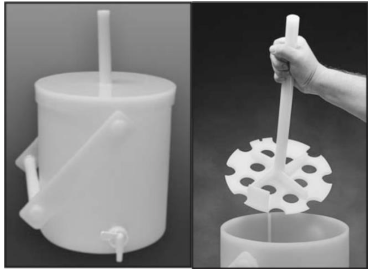

Figure A1. USGS-designed ‘churning splitter’ for unbiased subsampling for particulate samples (Bel-Art Products, part number 37805-0004, 37805-0008, 37805-0014).

- Preferentially, use closed, in-line systems for sampling and filtration (3.1.2; Figure 6) to reduce exposure to atmospheric particles. Drawing samples directly into POM-dedicated bottles, carboys, or subsampling device from the Niskin, while covering the borehole with a filling bell (e.g., Nalgene DS03900070; Figure A2).

	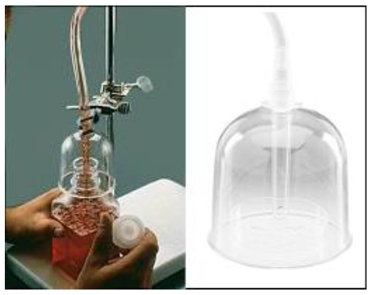

Figure A2. Polycarbonate filling bell (Nalgene, Thermo Fisher Scientific Inc., part number DS03900070).

- When removing a sample from filter holders in in-line filtration filters, ensure all the sample water has gone through the system. If the filter holder still contains unfiltered water, a significant loss of particles can result when opening the holder to remove the sample.  
- For pre-screening or size-fractionation, if applied, use either Teflon (70 μm) or Nitex (53 μm) mesh. U.S. GEOTRACES campaigns use 51 μm polyester mesh (Sefar Inc., Buffalo, NY) for its lower trace metal blank and greater open area than their 53 μm product. The larger fraction includes both swimmers and other particles. Whether to pre-screen will depend on the objectives, but the contribution of swimmers to POM in the surface ocean should be measured if bulk POM is the goal of the study.
- Shield water samples from excessive light by placing the carboy or other receiving container inside a dark, thick plastic bag, or use opaque containers. Exposure to high light may induce a stress response, including photoinhibition responses that may alter the POC and PN content.

### A.1.4 Sample Processing

*Section: 3.*

- When using open-funnel filtration systems, avoid plastic funnels. If collecting filtrate for subsequent filtration for blank corrections, use a glass filtration flask (Figure 4). Cover the tops of filtration towers with foil or a dedicated lid and other equipment to avoid contamination.
- Use custom-built filtration setups to improve sample processing efficiency. Such systems secure and accommodate the filtration hardware and allow the use of laboratory bottles to deliver sample water continually into the funnels (Figure 5).
- Sample water is exposed to ambient air during filtration. Closed, in-line filtration systems are a way to reduce contamination from airborne particles.
- For some applications, such as very low POM concentrations in oligotrophic environments, the use of HEPA “clean bubbles” might be warranted (Figure 3). 
- The maximum allowable vacuum or positive pressure during sample filtration is 17 kPa. That value should not be regarded as a recommended target but rather as a ceiling to avoid. The lowest pressure below that threshold that can be implemented is strongly encouraged.
- Store samples immediately after filtration. Filters must be folded in half, with the retained material on the inside of the folded filter. Most researchers opt for frozen storage (between -80 to-20 ◦C, or liquid N2 dry shipper or Dewar) and shipping to their home laboratories for further processing, while some choose to dry samples at sea before storage and shipment. If samples are dried at sea, the cleanliness of the drying oven or device is critical to prevent contamination.

### A.1.5 Filtrate Blank

*Section: 4.*

- Always correct measured values for filtrate blank associated with adsorption of DOC and TDN onto sample filters using either:
	- A correction from regression of total C and N mass per filter vs. volume filtered. Obtain data for regression by filtering at least three replicates of different volumes. The largest replicate volume should be at least three times larger than the lowest one.
	- Filtrate blank filters collected for each replicate sample. Filter the same volume of pre-filtered seawater from the same water sample replicate as filtered for POC and PN filters to obtain proper filtrate blank filters. 

### A.1.6 Analytical Filter Blank

*Sections: 6.2.3.*

- Several ‘analytical filter blanks’ should be evaluated to quantify and correct for potential sources of contamination for the blank associated with the filter itself, sample processing, and the acidification step to remove PIC and DIC. However, if filtrate blank filters (4.2) are used to correct for filtrate blank, those blanks would carry the blank signal associated with the filter analytical blank, as well as the sample packaging.
- Preparation of the analytical filter blank should be initiated in the field so that the blank signal incorporates all the factors that a typical sample may encounter throughout the entire process, including shipping, storage, and field and laboratory processing. As samples are processed, a subset of filters should be treated as regular samples, except that no sample water is filtered through them. Once in the laboratory, the filter blanks should be processed and analyzed as regular samples.

### A.1.7 Sample Processing for Analysis

*Section: 5.*

- Samples should ideally be dried using a freeze-dryer to minimize loss of any volatile fraction. 
- Otherwise, dry samples for 24 hours before analysis in a clean oven (55 ± 5°C) used exclusively for that purpose, in glass vials or covered glass petri dishes that have been combusted at 450°C for ~4 hours. 
- To remove inorganic C, expose samples to acid either by fuming concentrated acid or adding an aliquot of a dilute acid solution (~0.12 N). This step can be performed before or after drying samples, but after drying is recommended. The absolute amount of H+ added to the sample should be sufficient to remove the expected amount of inorganic C in the sample. For typical near-surface samples where the main source of POM is phytoplankton and organic detritus, 0.25 mL of 0.12 N HCl delivers 3x10-2 mEq H$^+$, which can potentially evolve 180 $\mu$g C as CO2[^5]. For comparison, the mean mass of organic C measured in the sample filters shown in Fig 15 was ~70 $\mu$g C. Higher acid concentration might be necessary for special cases, such as samples high in carbonate-rich suspended sediments or those collected during coccolithophore blooms. In those cases, additional replicates should be collected to assess the performance of either method in the complete removal of inorganic C.
- Do not use plastic surfaces or containers during the acidification of samples.
- Place samples in a large glass desiccator with an ungreased lid for 24 hours.
- Recommended acids are HCl or H3PO4, avoid H2SO4.
- Place or return samples to the drying oven (if not using a freeze-dryer) for 24 hours after the acidification is complete.
- If samples were dried in a freeze-dryer, place them in a glass desiccator with a desiccant such as molecular sieve or silica gel and a few NaOH pellets to neutralize any remaining acid. 

[^5]: i.e. CaCO3 = 2HCl -> CaCl2 + CO2 + H2O

### A.1.8 Sample Encapsulation

*Section 5.4*

- Filter samples are encapsulated in ultra-clean metallic containers compressed into pellets for analysis. Use the packaging material recommended and provided by the manufacturer of your specific instrument. 
- Filter samples wrapped with flat foil must be compressed with a pellet press (Figure 12) to ensure they will drop through the sample drop borehole without getting caught. If insufficient pressure is applied to form the pellets, the samples will expand in the sample carousel during a run and fail to drop.

### A.1.9 Weighing

*Section: 6.6.*

- Weighing of calibration, check standards, and reference materials should be performed on a balance with precision in the range of 0.001–0.0001 mg, set up on a stable weighing table such as those made of marble or granite.
- Weighing station should be in an enclosed, dedicated laboratory space free of air drafts, excessive airborne particles, or floor vibrations.
- Balance should be fitted with an anti-static kit to neutralize electrostatic charges that can harm weighing accuracy.
- Balance calibration should be certified at least annually by a qualified technician in the laboratory against a set of traceable, calibrated weights.

### A.1.10 Elemental Analysis

*Section 6*

- At instrument startup, before calibration and analysis of a new batch of samples, run a set of ‘conditioner’ standards so that the instrument reaches appropriate operating conditions. Proceed with calibration once the conditioner signal has stabilized (i.e., the reported elemental composition of the standards is within the instrumental margin of error).
- Instrument calibration is normally performed using a manufacturer-suggested standard compound. Examples of commonly used compounds are acetanilide (C8H9NO), cystine (C6H12N2O4S2), and sulfanilamide (C6H8N2O2S). Several calibration runs (> 6) must be performed so that any anomalous outliers can be eliminated without affecting calibration accuracy (see Section 6.3.1). To verify linear response and reliability, include calibration points in the expected range of samples. 
- During analysis, blank runs with empty standard and sample containers are run after every few samples (e.g., 4–6) to establish the baseline blank correction associated with the containers and any carrier-gas impurity. Some manufacturers recommend running blanks in between conditioning runs, so that the blanks and subsequent samples are evaluated during appropriate operation conditions (see Section 6.2.1).
- Instrumental drift should be monitored with check standards involving a primary standard appropriate for calibration. Check standards with effective C and N amounts in the range of samples should be placed at intervals no greater than every 5–6 samples.
- No reference material specific for POC exists yet. Some authors use NIST Buffalo River Sediment SRM 8704 (National Institute of Standards and Technology, 2013). Run at least some form of certified material at the beginning, middle, and end of each analytical run.
- Depending on the approach chosen to correct for the filtrate blank correction, an ‘analytical filter blank’ should be evaluated to correct for the blanks associated with the filter itself, sample processing, and the acidification step to remove PIC.
- As stated above, if filtrate blank filters (4.2) are used for that correction, those blanks would carry the blank signal associated with the filter analytical blank, as well as the sample packaging (6.3.2). If a linear regression approach is chosen for the filtrate correction, the analytical filter blank needs to be incorporated into the calculations. See Section 6.3 for guidance on calculations.

### A.1.11 Median Absolute Deviation in Outlier Detection

*Section 6.3.1*

Deviation from the median for outlier detection is a so-called ‘robust’ method preferable over approaches based on the mean. The median and the mean are measures of central tendency; however, the former is resistant to outliers. Deviation from the mean is often used to screen outliers. However, as outlined by Leys et al. (2013), various authors have described shortcomings, mainly due to its susceptibility to extreme values, which renders it unlikely to identify outliers in small samples. Section 6.3.1 describes the application of the ‘modified z-score method’ based on the median absolute deviation (MAD; Iglewicz and Hoaglin, 1993) to identify anomalous calibration runs for elemental analysis. In this appendix, a more comprehensive description and justification for this approach is given as well as recommendations for its implementation using common data analysis tools.

For a normally distributed sample of observations $x_1, x_2, ..., x_n$ with standard deviation, s, the z scores are given by

$$z_i = \frac{(x_i - \overline{x})^2}{s}$$	A1

A popular method that applies $z_i > 3$ as a criterion for flagging outliers was deemed inadequate for that purpose by Iglewicz and Hoaglin (1993). Despite its simplicity and ready implementation in various statistical tools, the authors used hypothetical small datasets to demonstrate its deficiencies in identifying outliers. They attribute this to the constraint introduced on each $z_i$ by subtracting $\overline{x}$ from $x_i$ and dividing by s. Large values of $|x_i - \overline{x}|$ contribute to s and keep $z_i$ from becoming large. The maximum value of $z$, $z_{max}$, is given by $(n-a) / \sqrt{n}$, and thus for samples $n < 10$, this approach would fail to identify any outlier using the criterion of $z_i > 3$, given that $z_{max}$ for n=10 is 2.85.

The modified $z$ score method in equations 6 and 7 offers a suitable alternative. The estimator $MAD (x)$ is robust to influence from extreme values used to compute the modified $z$ scores, $M_i(x)$. The constant 0.6745 in (7) is needed because it is the 0.75th quartile of the standard normal distribution to which MAD converges to for large n.

### A.1.8.1 Implementation

Exercise caution when employing this approach using statistical packages or other data analysis languages (e.g., Matlab, R, Python), given that those implementations vary slightly and similarly named functions generate different products. For example, in Matlab the function `mad(x)` gives the *mean* absolute deviation from the median. In contrast, in R (R Core Team, 2018) the equally named function gives the median absolute deviation from the median. To get MAD in Matlab, employ the syntax `mad(x,1)`. In version R2017a, Matlab introduced the function `isoutlier()`, which directly computes outliers based on 3 x MAD criterion. In Python, the stats library within the SciPy library contains an implementation of MAD as the function: `scipy.stats.median_absolute_deviation(x)` (SciPy Community, 2019). 

